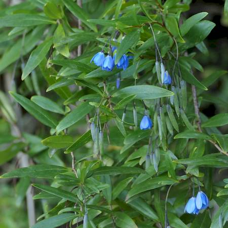

## Pittosporaceae
# Billardiera heterophylla
**common names:** bluebell creeper

**Plant Form** Climbing shrub. **Size** Up to 2 m high, climbing to 5 m. **Stem** Twining, vine like. **Leaves** Glossy green upper surface, 1-6 cm long. **Flowers** Small clusters of blue or pink-white, with 5 petals drooping in bell shape. **Fruit and Seeds** Small, fleshy, oval shaped to 2 cm, ripening from green to blueish-purple, with more than 50 seeds. **Habitat** Gardens, woodland, coastal headland. **Distinguishing Features** Several close lookalikes in native range in WA, outside of native range only hybrid Billardiera are similar.

   *Foliage and flowers* 

   *Leaves amd flowers* 

