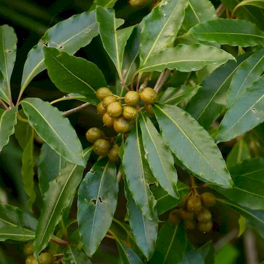
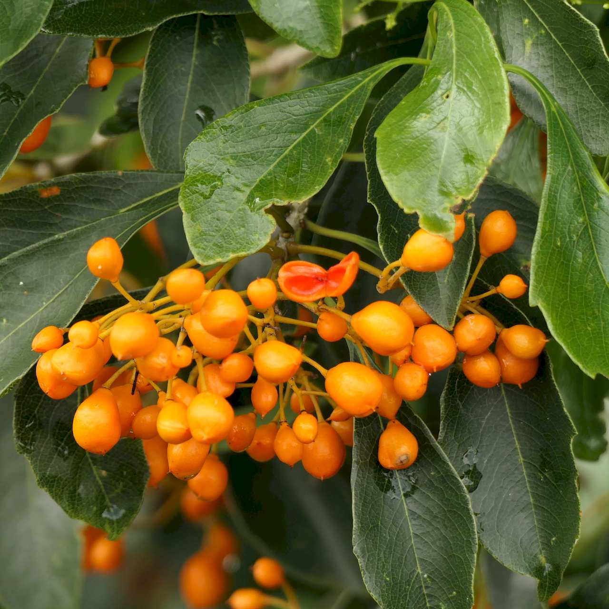
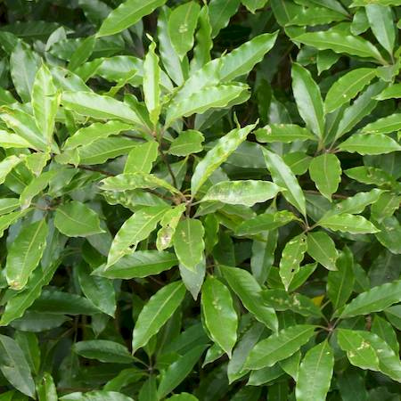
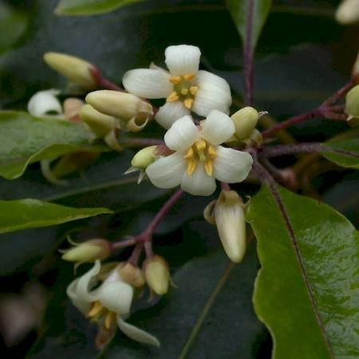

## Pittosporaceae
# Pittosporum undulatum
**common names:** sweet pittosporum

**Plant Form** Large evergreen shrub or tree. **Size** Up to 25 m tall. **Stem** Smooth light grey to brownish coloured bark, new stems green. **Leaves** On stalks, smooth and glossy green, elongated elliptical, with wavy edges. **Flowers** Small creamy white flowers, up to 2 cm diameter, with 5 petals which curve backwards, in clusters, of 4-5. **Fruit and Seeds** Hard, round or slightly flattened capsules, 1.5 cm diameter, starting green but turning distinctive orange then splitting open to release 20-30 seeds when ripe. **Habitat** Rainforests, gardens, grasslands, roadsides, urban woodlands, riparian areas. **Distinguishing Features** Distinctive fruit and wavy edged leaves.

  
 *Leaves and unripe fruit* 

  
 *Ripe fruit (seed pods)* 

  
 *Foliage* 

  
 *Flowers (RG FJ Richardson)* 

