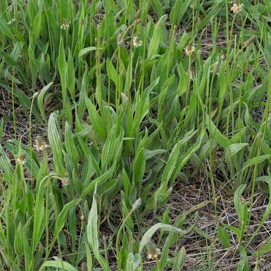
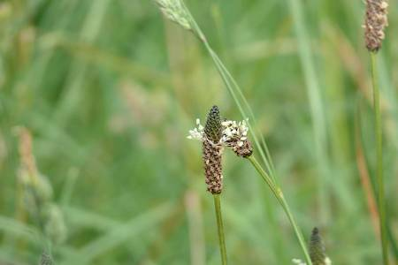

## Plantaginaceae
# Plantago lanceolata

**Plant Form** Annual or biennial rosette herb. **Size** Up to 45cm tall.

   *Often flat, leaves have 4 veins* 

   *Looks like grass if many seedlings* 

   *Leaves can be wrinkly* 

   *Flowers not showy* 

