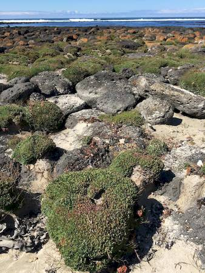

## Plumbaginaceae
# Limonium hyblaeum
 **Plant Form** Perennial rosette herb. **Size** Up to 25 cm tall. **Stem** Flowering stalks above rosette very slender and branching. **Leaves** Dense clusters of circular green to red leaves, spiraling to form rosette that's cushion like. **Flowers** Pink or purple tube shaped, arranged along stems, forming clusters. **Fruit and Seeds** Spreads by seed or vegetatively. Tiny seeds in membranous structures. **Habitat** Coastal headlands, heath, marshes, dunes, gravel. **Distinguishing Features** Only lookalike in Australia is Sea Lavender which is also a weed.

 *Flowers* 

 *Foliage* 

 *Growth habit* 

 *Plant* 

 *Sprey of flowers* 

