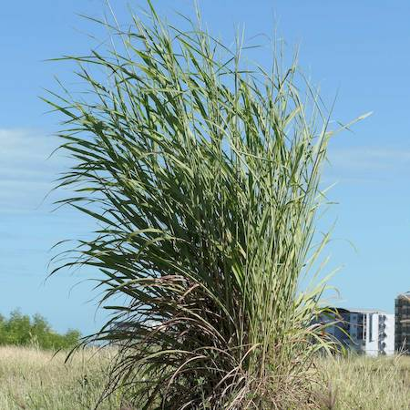
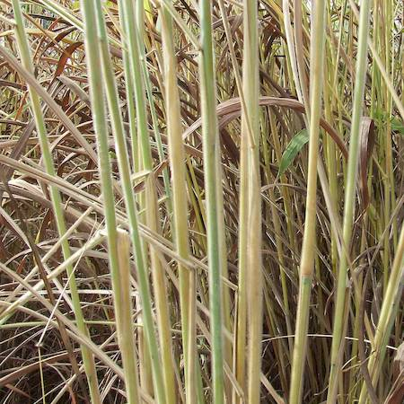

## Poaceae
# Andropogon gayanus
**common names:** gamba grass

**Plant Form** Very tall grass. **Size** Up to 4 m tall. **Stem** Robust and covered in soft white hairs. **Leaves** Broad, strap like and long, with white midrib. **Flowers** V-shaped fluffy head above the leaves on thick stems. **Fruit and Seeds** Seeds 7-9 mm long, hairy, with bent and twisted awns. **Habitat** Rangelands, roadsides and bushland on urban fringes. **Distinguishing Features** Height and hairy stems, harder to distinguish when younger.

  
 *Very tall grass (4m +)* 

  
 *Paired inflorescences* 

  
 *White midrib* 

  
 *Hairy stems* 

