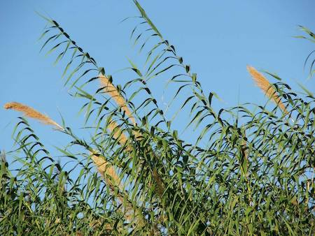

## Poaceae
# Arundo donax
**common names:** giant reed

**Plant Form** Very tall grass. **Size** Up to 8 m tall. **Stem** Large and somewhat woody, sometimes 2 cm diameter, bamboo like. **Leaves** Sheathed initially, but blades are up to 1 m long when mature, lance shaped. **Flowers** Erect, plume loosely, spreading and fluffy 30-70 cm long. Beige or light brown. **Fruit and Seeds** Reproduces via rhizomes. **Habitat** Along riverbanks and beside lakes, swamps, roadsides, urban bushland. **Distinguishing Features** Taller than Common reed, wider leaves than Elephant grass.

  
 *Foliage in tropical location* 

  
 *Foliage in temperate location* 

  
 *Flower spikes* 

  
 *Close-up of leaves* 

