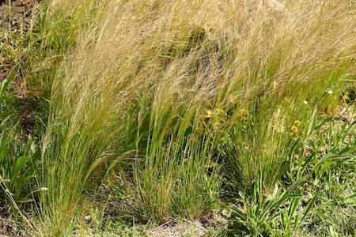
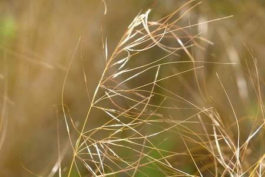

## Poaceae
# Austrostipa scabra

**Plant Form** Tufted grass. **Size** Stems up to 60 cm tall.

 *Fine grass, likes hard ground* 

 *Silky flowers held high above leaves* 

 *Seed head close-up* 

