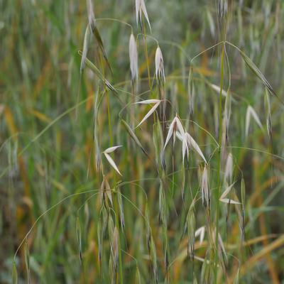
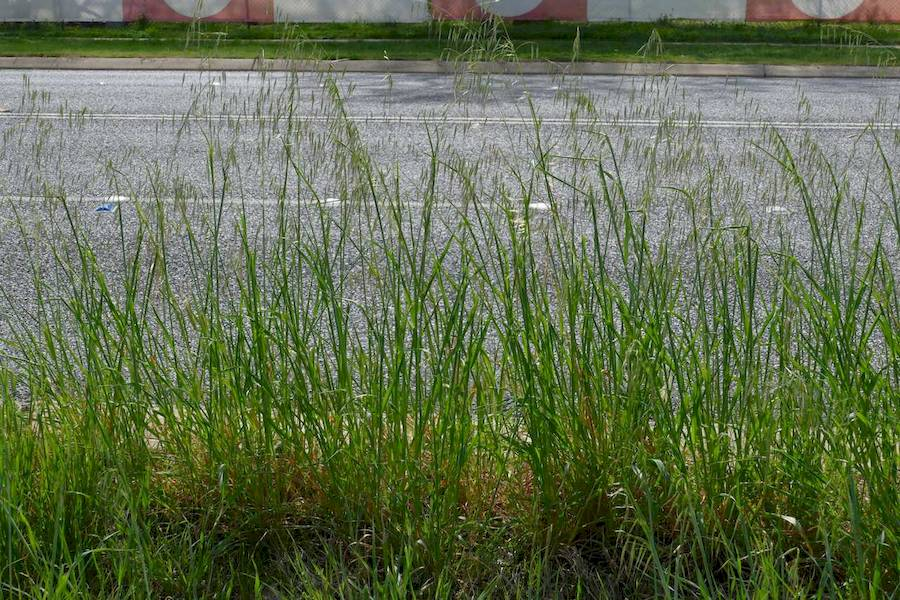
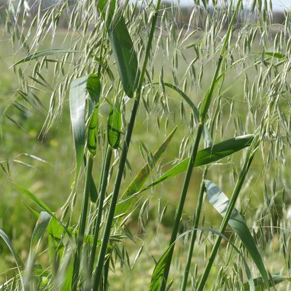
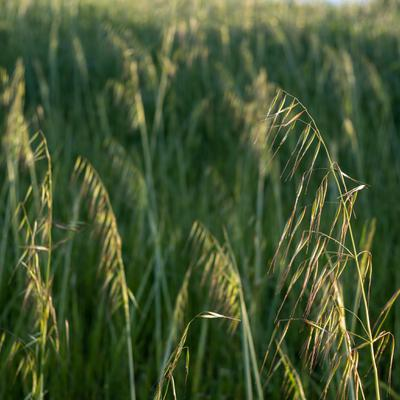

## Poaceae
# Avena
 **Plant Form** Grasses. **Size** Up to 2 m tall. **Stem** Hollow, erect. **Leaves** Flat, up to about 50 cm long, sheathed with a membrane like structure at base. **Flowers** Loose, open with group of usually 2-3 spikelets with a lance shaped covering (glume). **Fruit and Seeds** Elongated oval shaped seeds with long awns. **Habitat** Pastures, agricultural land, grasslands, open woodland, roadsides, disturbed areas. **Distinguishing Features** Distinctive as a genus but very hard to tell between species. Usually need photo of spikelets with covering removed.

 *White husks after seed is shed* 

 *Tall grass* 

 *Grass is robust* 

 *Sseedheads fine and pendulous* 

