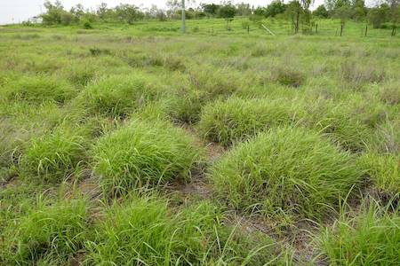
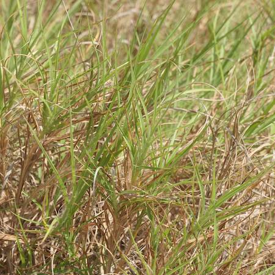

## Poaceae
# Cenchrus ciliaris
 **Plant Form** Tufted grass. **Size** 30 cm to 1.5 m tall. **Stem** Erect, slender. **Leaves** Bluish green blades 1 cm wide, hairy, flat or folded with pointed tops. **Flowers** One to four spikelets, purple. **Fruit and Seeds** Heads are dense and cylindrical with clusters of white bristles making them look fluffy. **Habitat** Roadsides, rail lines, rangelands, pastures. **Distinguishing Features** Dense tussocks and fluffy heads may help distinguish it. Other Cenchrus species are very similar.

 *Often clumpy* 

 *Flowers* 

 *Older leaves smaller and bunchy* 

