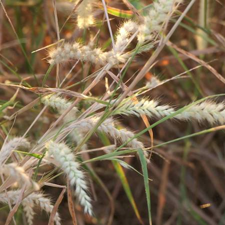
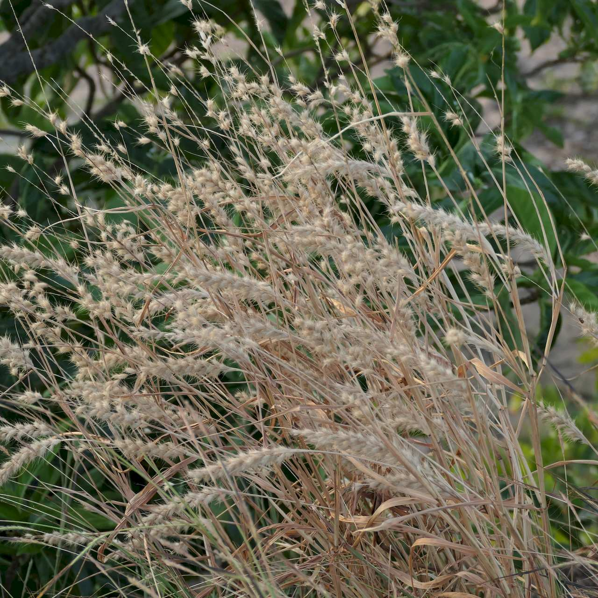
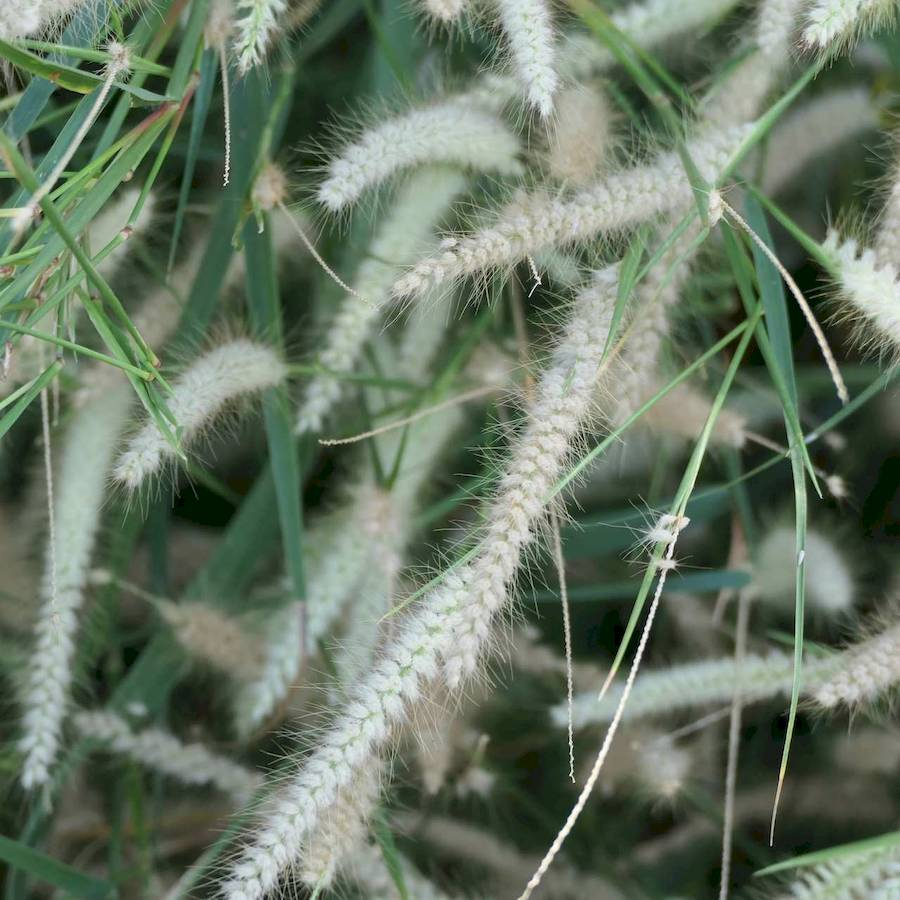
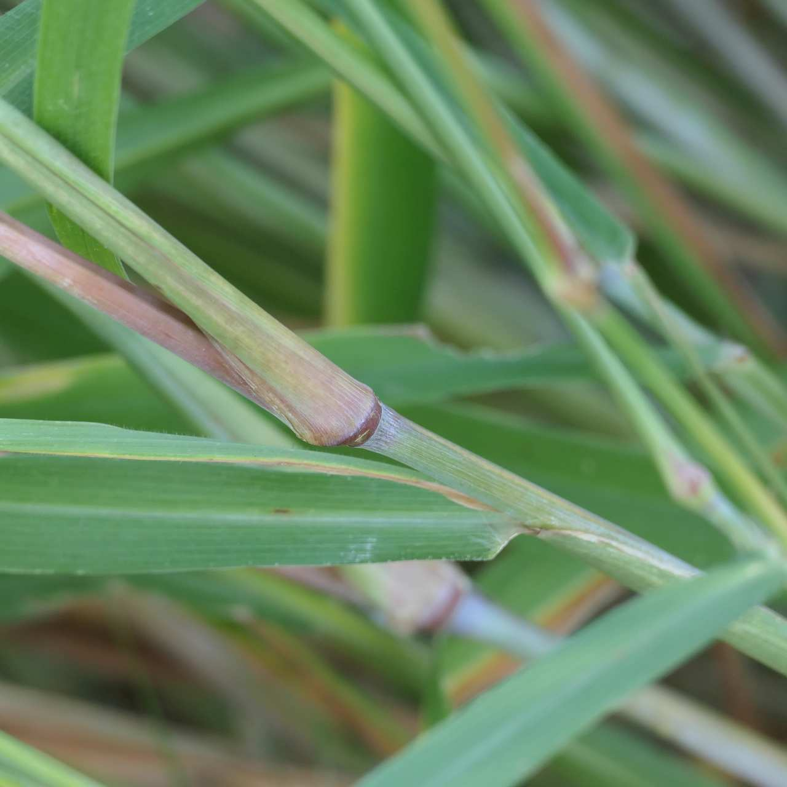

## Poaceae
# Cenchrus pedicellatus

**Plant Form** Annualtufted grass. **Size** 30cm to 1.5m tall. **Stem** Slender, straight, many in tussock. **Leaves** Blades to 45 cm long, hairy or hairless, ring of hair at base. **Flowers** Spikelike, to 20 cm long. Dense, cylindrical, cream-coloured with purple tinge. **Fruit and Seeds** With bristles and dense wooly hairs, spaced on spike. **Habitat** Pastures, roadsides, waste areas, creeklines. **Distinguishing Features** Very similar to perennial Mission grass and various other feathergrasses.

   *Flowers are whitish* 

   *Grass dies in dry season* 

   *Flowers are fluffy* 

   *Stems are hairless* 

