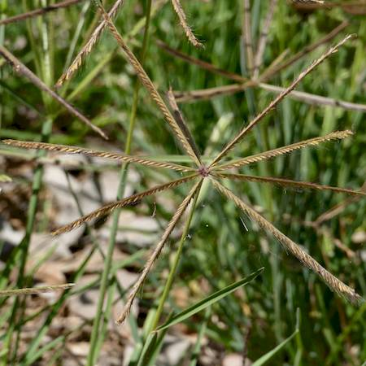
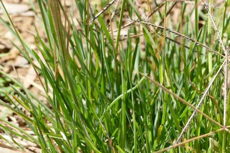

## Poaceae
# Chloris truncata
**common names:** windmill grass

**Plant Form** Grass. **Size** Up to 50cm tall. **Stem** Flattened and rough, straight. **Leaves** Folded up to 15 cm long blades. **Flowers** Windmill-like spread of 5-10 spikes radiating from single point on end of stem. **Fruit and Seeds** Green to purple to black flat-topped florets in spikelets with awns to 15 mm long. **Habitat** Pastures, bare ground, wasteland. **Distinguishing Features** Distinguished from other-windmill like grasses by awns and flat-topped florets.

  
 *Low grass with big flowers* 

  
 *Flower spikes break off and roll away* 

  
 *Young flower spikes are sheathed* 

  
 *Leaves* 

