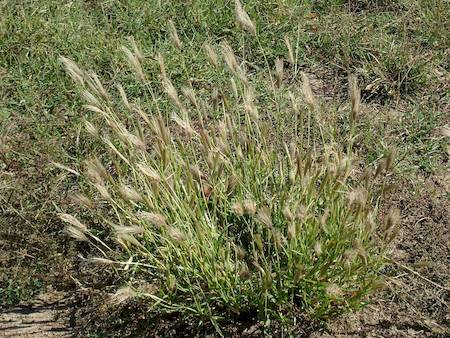

## Poaceae
# Chloris virgata
**common names:** feathertop Rhodes grass

**Plant Form** Grass. **Size** Up to 1.2m tall. **Stem** Upright or spread outwards with upright tips. **Leaves** Long, narrow blades, mostly hairless. **Flowers** Greyish green to whitish, feathery,at tips of head, branching from same point. **Fruit and Seeds** Hairy spikelets which leave 2 bracts when they fall off. **Habitat** Agricultural land, bare ground, disturbed areas, roadsides, creek lines. **Distinguishing Features** Easily confused with other Chloris species, best chance is combination of characteristics.

  
 *Medium-sized with whitish flowers* 

  
 *Flower spikes* 

  
 *Leaves* 

