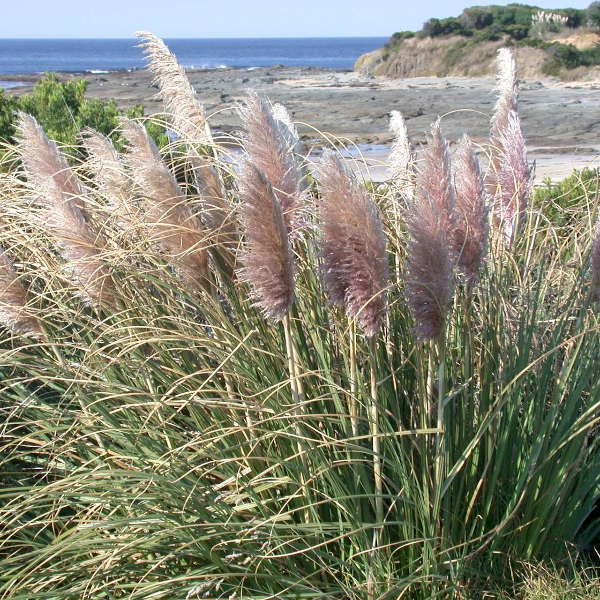
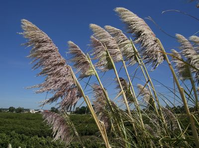
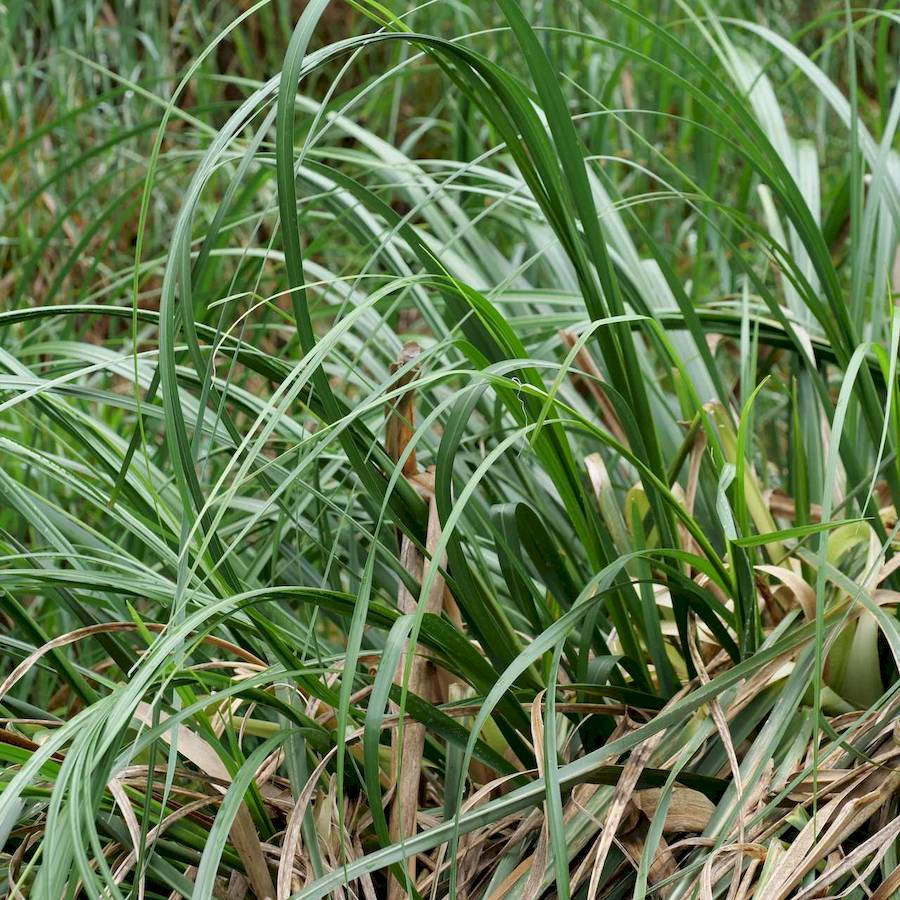

## Poaceae
# Cortaderia
**common names:** Pampas grass

**Plant Form** Huge perennial tussock grass. **Size** Up to 6m tall. **Stem** Tall, upright, in dense clusters. **Leaves** Drooping, up to 2 m long, with serrated edges, bluish to bright green above and dark to bright green below. **Flowers** Large feathery plumes, white to brownish or pinkish, with silky hairs, up to 1 m long on stems, many flowers per plume. **Fruit and Seeds** Huge numbers of tiny 2-3 mm long seeds in plumes. **Habitat** Roadsides, railway lines, timber plantations, swamps, riverbanks. **Distinguishing Features** Distinguished by size, large fluffy plumes, and not having a bamboo-like stem.

   *Growth habit* 

   *Flowers* 

   *Leaves* 

