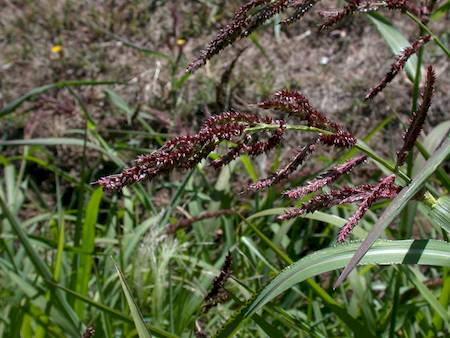

## Poaceae
# Echinochloa crus-galli
**common names:** barnyard grass

**Plant Form** Variable annual grass. **Size** Up to 1 m tall. **Stem** Clumped, growing from nodes. **Leaves** Deep green, flat, no ligule (joint structure), tapering and slightly hairy near stem. With prominent midrib. **Flowers** Up to 15 spikelets in lance shaped heads, not in obvious rows. Green and tinged with reddish purple. **Fruit and Seeds** Pale brown when ripe. **Habitat** Disturbed areas, riverbanks, wetlands. **Distinguishing Features** Spikelets not in obvious rows, and wider leaves differs from possibly native (but also weedy) Echinochloa colona.

  
 *Close up of seed* 

  
 *Seed heads and leaves* 

  
 *Often in wet areas* 

  
 *Leaves can be broad* 

