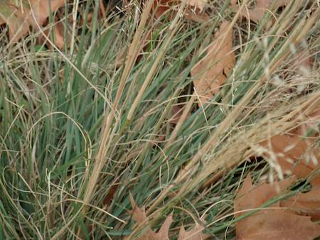
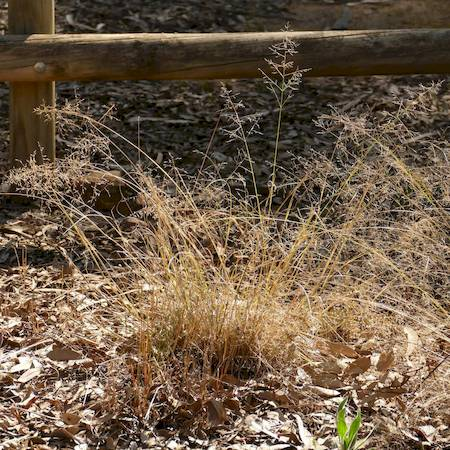
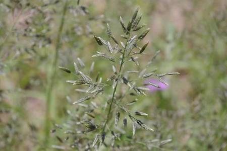

## Poaceae
# Eragrostis cilianensis
**common names:** stinking lovegrass

**Plant Form** Tufted annual grass. **Size** Up to 60 cm tall. **Stem** Round, generally erect but sometimes bending or drooping, have glands near the nodes. **Leaves** Rolled onto stem with hairy joint, often olive green, flat, with obvious veins and glands along midvein. **Flowers** Heads stacked in dense, sometimes open oval shaped cluster, green to purplish grey. **Fruit and Seeds** Tiny under 1 mm reddish brown seeds, smooth, shiny, with dimples. **Habitat** Crops, pastures, roadsides, footpaths, gardens, lawns. **Distinguishing Features** Pungent odour from glands when leaves crushed. Flower head shape and structure.

 *Very fine grass, may have curly leaves* 

 *Flowers that are like grey mist* 

 *Immature inforesence* 

 *Minute overlapping sheaths* 

