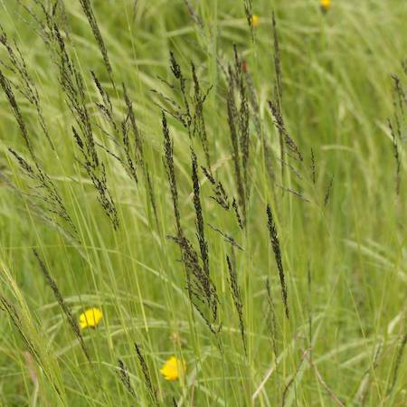
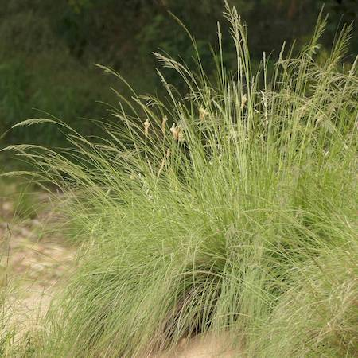

## Poaceae
# Eragrostis curvula
**common names:** African lovegrass

**Plant Form** Tufted perennial grass. **Size** Up to 1 m tall. **Stem** Slender, upright, hairless. **Leaves** Flat or rolled with spreading blades, sheath partially enclosing the stem, yellowing with age. **Flowers** Compact seed head spreading wide and loose with age, spikelets are grey to purple. **Fruit and Seeds** Tiny seeds 0.3 mm to 0.7 mm long, oval shaped. **Habitat** Roadsides, disturbed sites, spreading into pasture and grasslands. **Distinguishing Features** Loose grey seedheads and stems forming into large tufts.

  
 *Uniform dull light green* 

  
 *Young flowers are dark* 

  
 *Often forms clumps* 

  
 *Flowers held low near leaves* 

