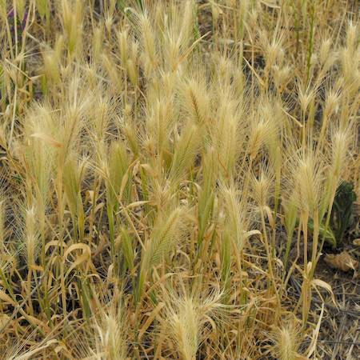

## Poaceae
# Hordeum leporinum
**common names:** barley grass

**Plant Form** Tufted short annual grass. **Size** Up to 50 cm tall, usually under 20 cm. **Stem** Upright, narrow. **Leaves** Hairless or sometimes hairy, flat, up to 15 cm long, very narrow. **Flowers** Dense cylindrical head of spikelets, 3-10 cm long with long bristles. **Fruit and Seeds** Seeds in groups of 3, with one awn. **Habitat** Pastures, crops, roadsides, waste areas. **Distinguishing Features** Distinctive as a genus but very hard to distinguish individual species.

  
 *Wheat-like heads* 

  
 *Very short grass* 

  
 *Grows in Spring, dies in Summer* 

