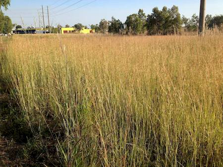
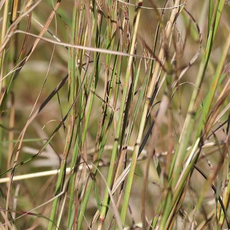

## Poaceae
# Hyparrhenia rufa
**common names:** thatch grass

**Plant Form** Perennial tufted grass. **Size** Up to 1.2 m tall. **Stem** Erect, densely tufted. **Leaves** Flat, 30-60 cm long, narrowed at base, with very rough edges. **Flowers** Heads 20-40 cm long, wiry, hairy, reddish brown. **Fruit and Seeds** Bristled and twisted with 2 bends. **Habitat** Roadsides, open woodlands, pastures. **Distinguishing Features** Distinct, although subspecies are hard to tell apart.

   *Tall, thin, straight* 

   *Seed heads in pairs* 

   *Seed like small spear grass* 

   *Stems and leaves fine* 

