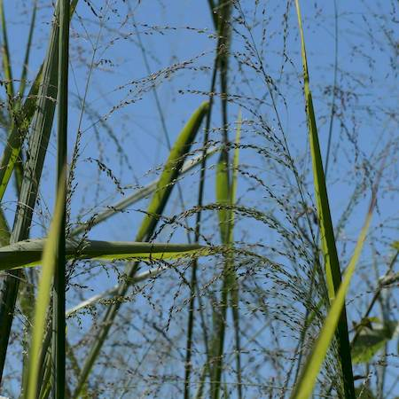

## Poaceae
# Megathyrsus maximus
 **Plant Form** Tufted perennial grass. **Size** Up to 3m tall. **Stem** Erect branched, vary from hairless to hairy, lowest seed head branches form a whorl around stem. **Leaves** Spreading blades that are very long 15-100 cm, with a hairy sheath enclosing the stem, usually sparsely hairy, with flat edges, with prominent white midrib. **Flowers** Heads are loosely branched and open, 12-60 cm long, with small oval shaped spikelets which are usually green but sometimes reddish. **Fruit and Seeds** One fertile floret in spikelets., seed is dispersed by varous means. **Habitat** Crops, forests, parks, roadsides, grassland, riparian areas. **Distinguishing Features** Combination of size, thick leaf blades and open flowerheads.

 *Large branched panicles* 

 *Leaves can grow from stems* 

 *Young plants grow wide* 

 *Old plants, many erect canes* 

