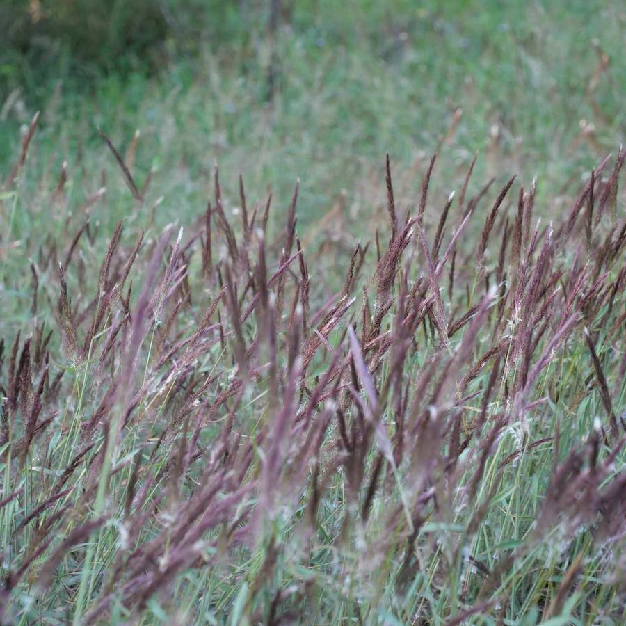
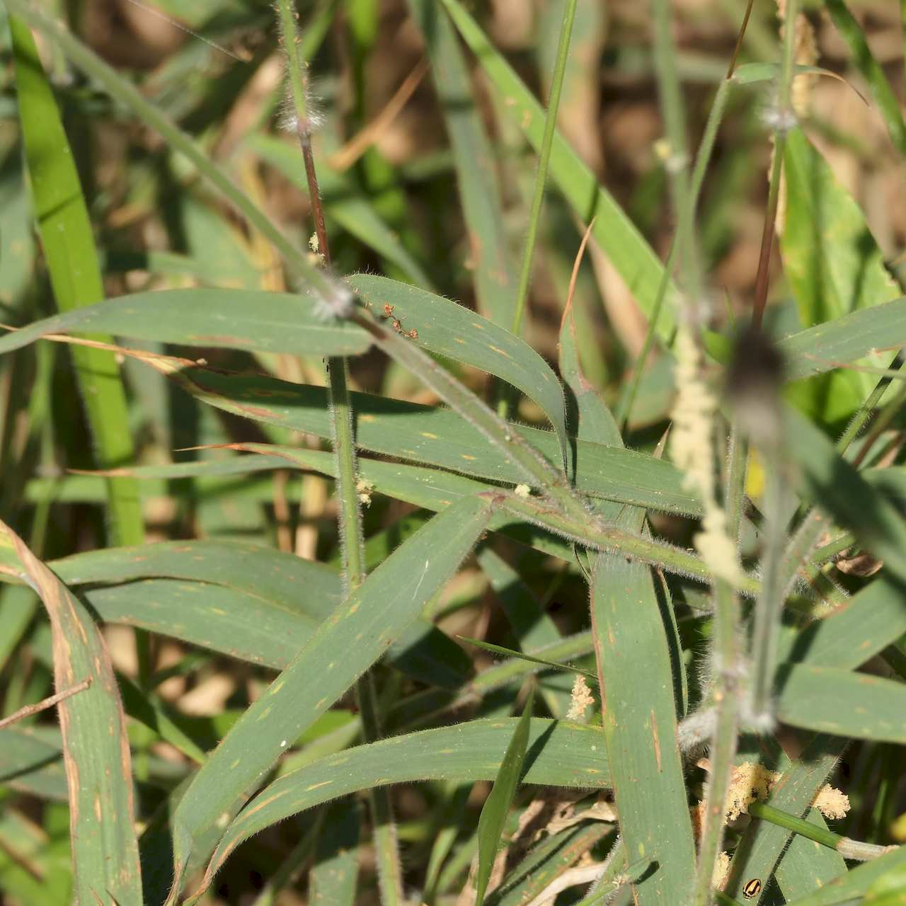
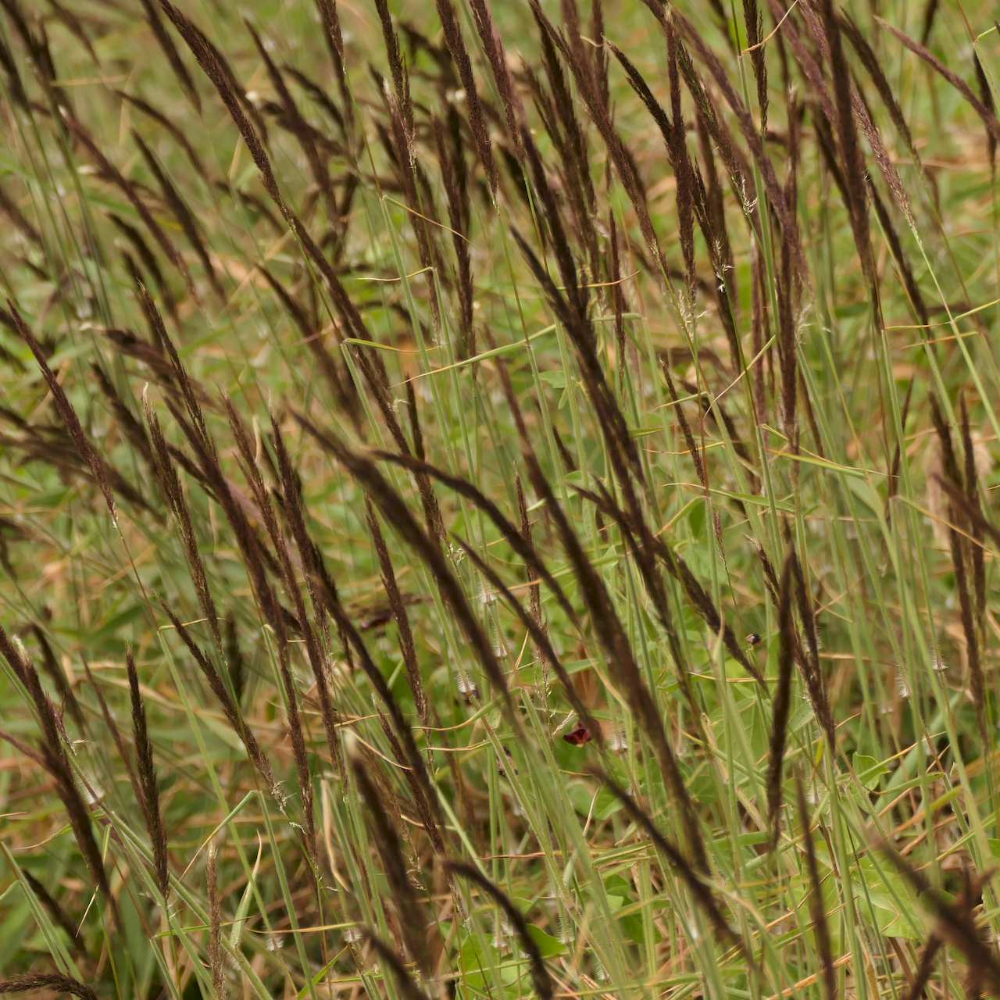
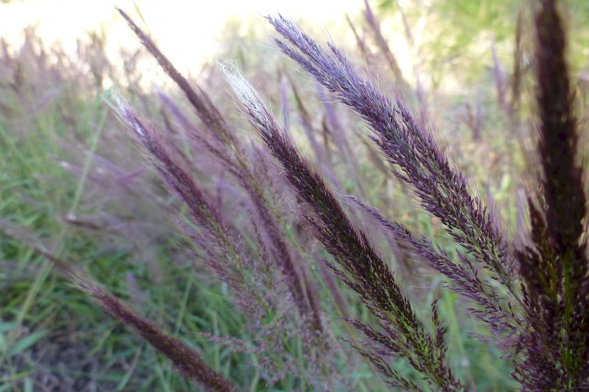

## Poaceae
# Melinis minutiflora

**Plant Form** Perennial grass. **Size** 60cm to 1.5m tall.

  
 *Forms swards* 

  
 *Leaves are furry and smell* 

  
 *New flowers spikes are dark* 

  
 *Becoming lighter on opening* 

