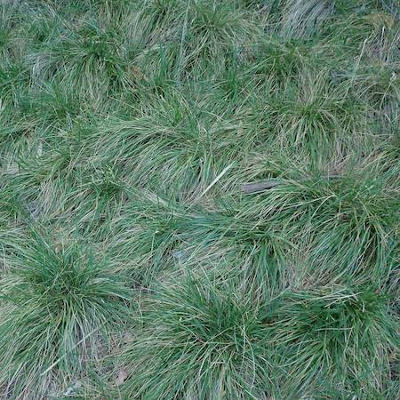
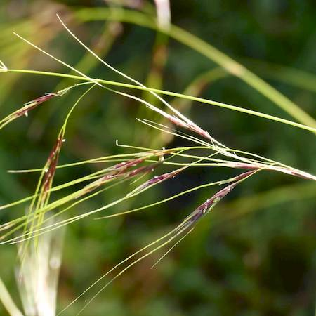
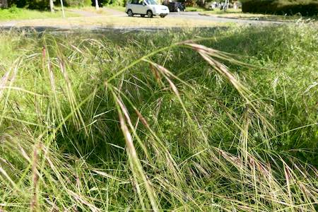

## Poaceae
# Nassella neesiana
**common names:** Chilean needle grass

**Plant Form** Tussock forming erect perennial grass. **Size** 30 cm to 1.2 m tall. **Stem** Thin, upright. Leaf joint is smooth with tufted hairs either side. **Leaves** About 30 cm long, flat and slightly in-rolled. Strongly ribbed on upper surface, sometimes hairy. **Flowers** Heads are loosely branched, open and mostly above leaves, 10-40 cm long with 50-200 flowers. **Fruit and Seeds** Seeds pointed at base, 6-10 mm long, lumpy and pale brown at maturity with long awns 6-9 cm and bent. **Habitat** Pastures, grassy woodlands, roadsides, along creeks and rivers. **Distinguishing Features** Combination of features, seed has tiny distinctive crown at base of awn.

  
 *Grows in tussocks* 

  
 *Seed heads* 

  
 *Tussocks hidden by flowers* 

  
 *Roots eaten by Cockatoos* 

