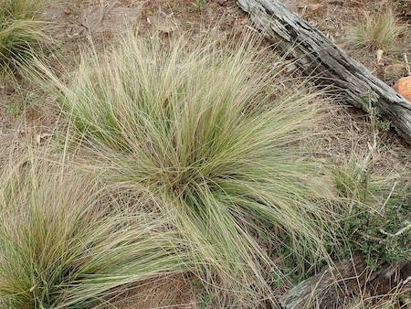
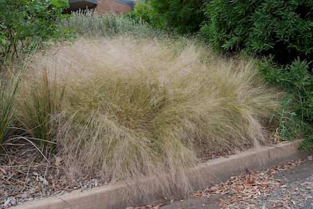
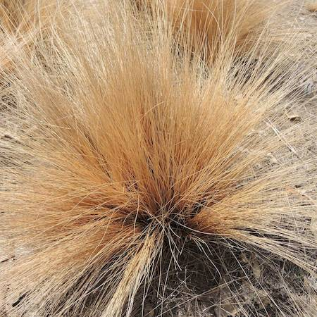

## Poaceae
# Nassella trichotoma
**common names:** serrated tussock

**Plant Form** Tussock forming erect perennial grass. **Size** 20-70 cm tall. **Stem** Narrow and upright, with papery ligules (leaf joints). White at base like shallots. **Leaves** Very narrow and tightly rolled blades. **Flowers** Branching, drooping seed heads up to 35 cm long with a single seed at end of each branch. Purple tinge when mature from seed bract. **Fruit and Seeds** Golden brown, hard, small 1.5 mm long with awns offset from centre. **Habitat** All types of terrain. Pastures, roadsides, grasslands, bare ground. **Distinguishing Features** Extremely similar appearance to native Austrostipa or Poa species, best chance is an expert inspecting fertile material.

 *Grazed plants are like stiff brushes* 

 *Mature plants - rounded tussocks* 

 *Flowers and seed are very fine* 

 *Seed close-up* 

 *Infested pasture* 

 *Weedicide treated plants are orange* 

