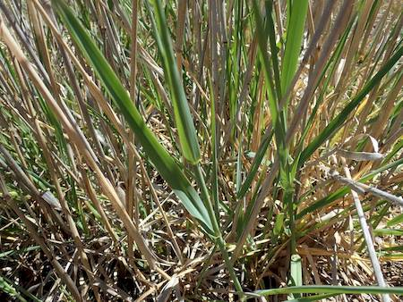
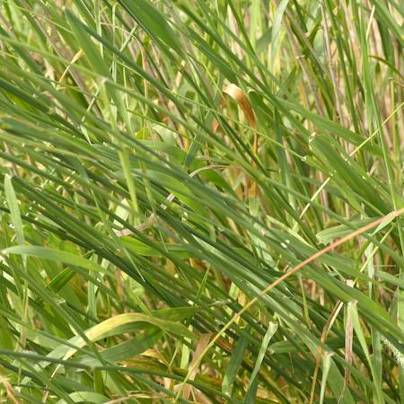

## Poaceae
# Phalaris aquatica

**Plant Form** Erect tufted perennial grass. **Size** Up to 1.5m tall.

   *Large scaly seed heads* 

   *Sward* 

   *Flowers* 

   *Erect growth habit* 

   *Hays off when upright* 

   *Stems and leaves* 

