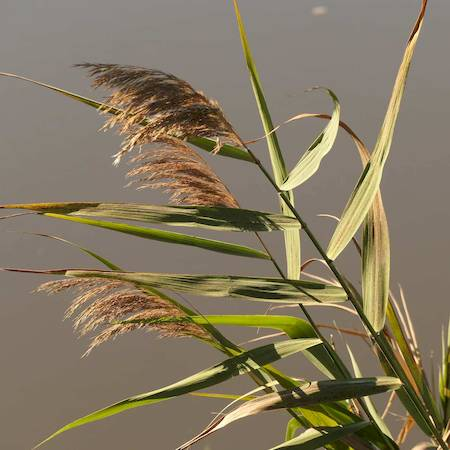

## Poaceae
# Phragmites australis
 **Plant Form** Tall perennial semi-aquatic grass. **Size** Up to 6m tall.

 *Leaves and flowers* 

 *Grows on river banks* 

 *Dies back in winter* 

 *Often fills swamps* 

