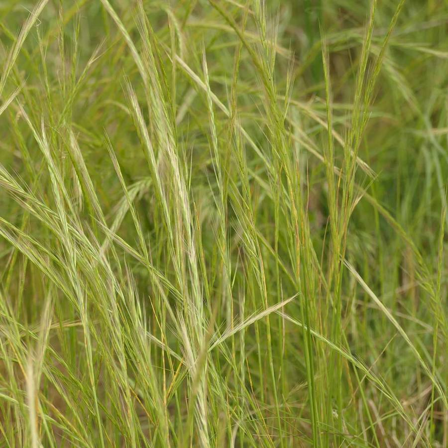
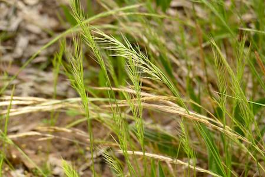
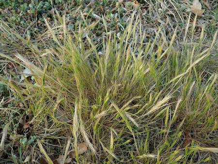

## Poaceae
# Vulpia myuros
**common names:** silver grass

**Plant Form** Densely tufted annual grass. **Size** Up to 60 cm tall.

  
 *Flower heads* 

  
 *Flower heads, close up* 

  
 *Plant* 

