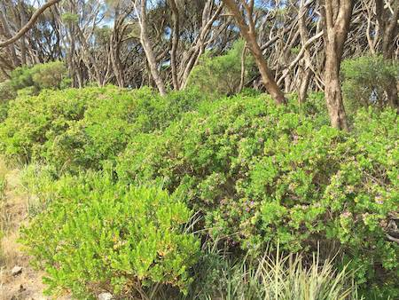

## Polygalaceae
# Polygala myrtifolia
**common names:** polygala

**Plant Form** Upright shrub. **Size** 1-3 m tall. **Stem** Young stems covered in fine curled hairs, older stems hairless and greyish-brown. **Leaves** Crowded close together, alternately arranged, oval or egg shaped with smooth edges up to 4 cm long. **Flowers** Pink or purple and pea-like, with wings, central keel-like structure is more white. **Fruit and Seeds** Capsule, flattened and circular to 1 cm diameter, green ageing to brown. 2 hairy black seeds per capsule. **Habitat** Coastal headlands and outcrops. **Distinguishing Features** Distinctive from all but hybrid cultivated varieties.

  
 *Flowers and leaves* 

  
 *Leaves* 

  
 *Growth habit* 

