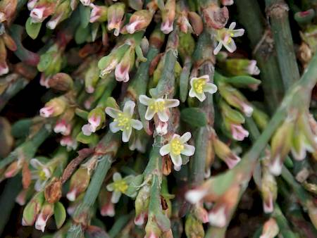

## Polygonaceae
# Polygonum arenastrum

**Plant Form** Sprawling mat-forming herb. **Size** Up to 30cm tall, mats up to 1.5m diameter.

   *Small thick leaves* 

   *Flowers are small* 

   *Forms a flat mat* 

