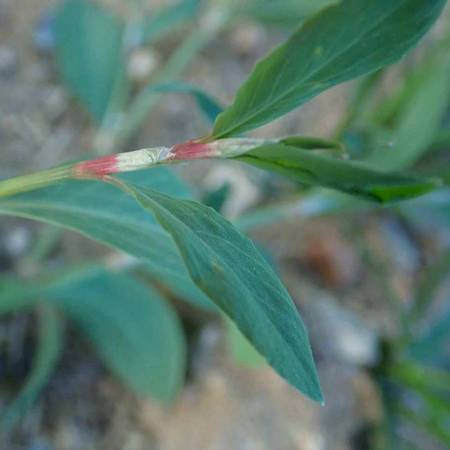

## Polygonaceae
# Polygonum aviculare

**Plant Form** Sprawling mat-forming herb. **Size** Up to 30 cm tall, mats up to 1 m diameter.

 *Leaves about 2 cm long* 

 *Leaf sheaths usually reddish* 

 *Growth habit, grows flat* 

