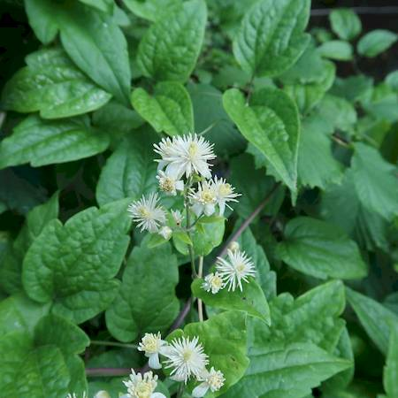

## Ranunculaceae
# Clematis vitalba
**common names:** old man's beard

**Plant Form** Perennial climbing vine. **Size** Up to 30m high or long. **Stem** Very long, woody, with 6 prominent ribs and pale bark. **Leaves** Opposite pairs on stem, 5 leaflets widely spaced and hairy with toothed or smooth edges, falling off in Autumn. **Flowers** Creamy white, fragrant, 2-3 cm diameter. **Fruit and Seeds** Grey, hairy seeds with distinctive white beard-like plumes in clusters persisting over winter. **Habitat** Woodlands and forests, riverbanks, heathland, disturbed areas. **Distinguishing Features** Seed plumes. Also native Clematis usually have 3 leaflets rather than 5.

 *Leaves and flowers* 

 *Fluffy seeds* 

 *Seeds on vine* 

