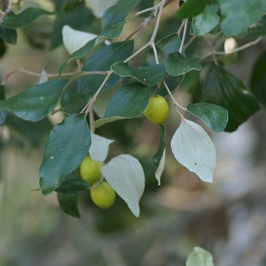

## Rhamnaceae
# Ziziphus mauritiana
**common names:** chinee apple

**Plant Form** Thorny densely-branched shrub or small tree. **Size** Up to 10 m tall. **Stem** Young stems zig-zagging with single curved thorn at each joint, mature stems woody and fibrous. **Flowers** Small, inconspicuous greenish white, unpleasant smelling. **Fruit and Seeds** Cherry sized 2-5 cm diameter, pale yellow to reddish orange when ripe, look like little apples. **Habitat** Floodplains, watercourses, roadsides, disturbed sites, pastures, open woodland. **Distinguishing Features** Larger fruit than other Ziziphus species, fruits are fleshy rather than hard shelled in Strychnine tree.

  
 *Leaves white underneath* 

  
 *Leaves three veined* 

  
 *Stems are spiny* 

