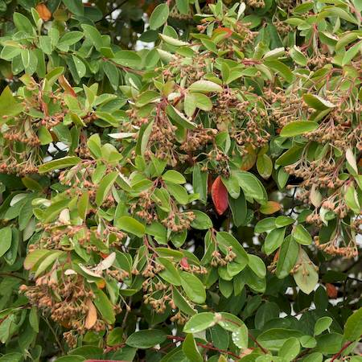

## Rosaceae
# Cotoneaster glaucophyllus
 **Plant Form** Many stemmed shrub or small tree. **Size** Up to 7m tall. **Stem** Numerous branching stems from near base of trunk, woody with sometimes shiny upper stems. **Leaves** Oval shaped, upper surface smooth and shiny dark green, lower surface pale greenish grey and hairy when young. **Flowers** White with 5 petals in clusters of 20-60, 2-10 cm wide along branch, on short stalks. **Fruit and Seeds** Shiny red berries 5-7 mm diameter. **Habitat** Old gardens, woodlands, grasslands, roadsides, waste areas. **Distinguishing Features** Distinguished from other Cotoneasters by larger leaf size.

 *Ripe fruit* 

 *Flowers* 

 *Foliage* 

