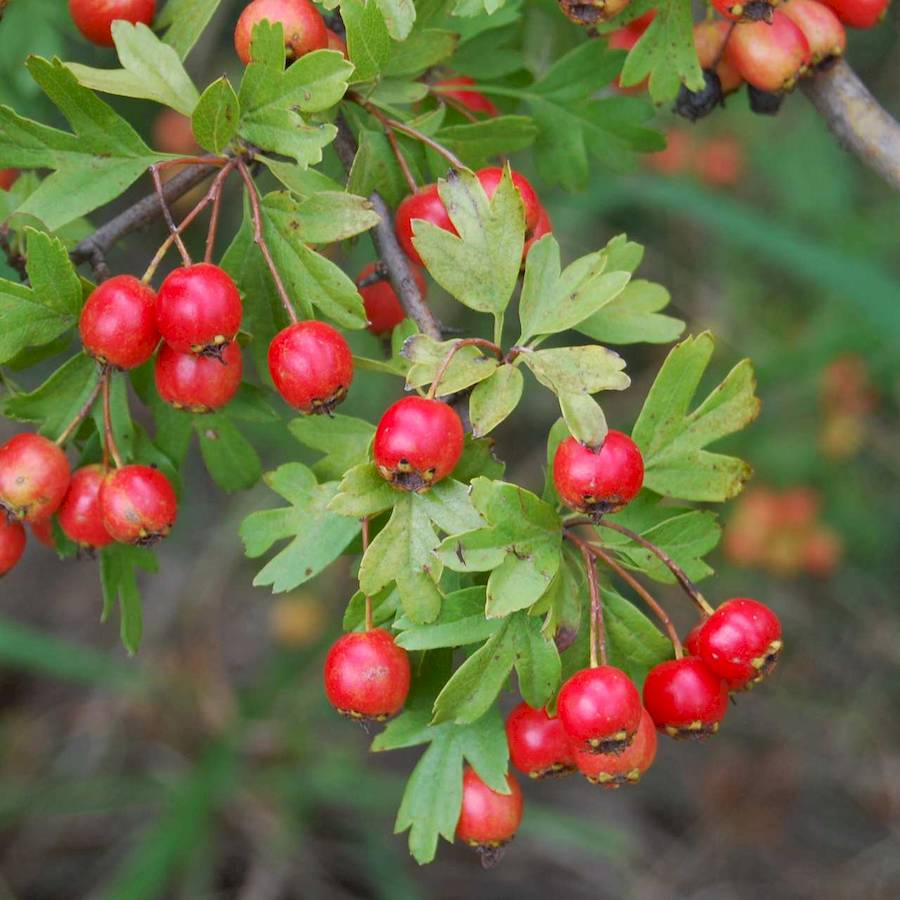
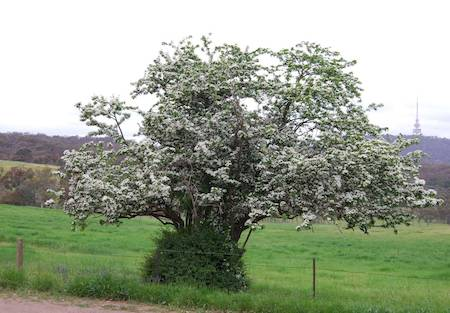
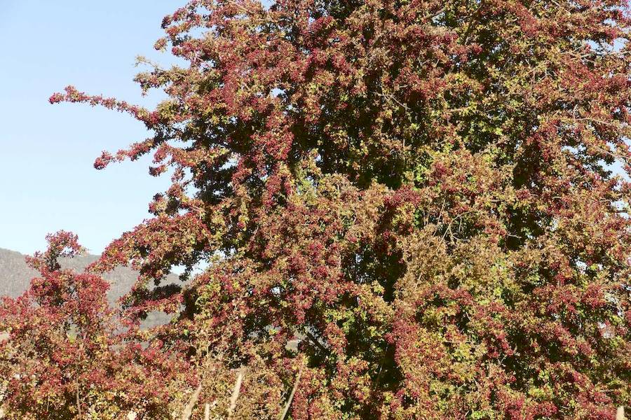
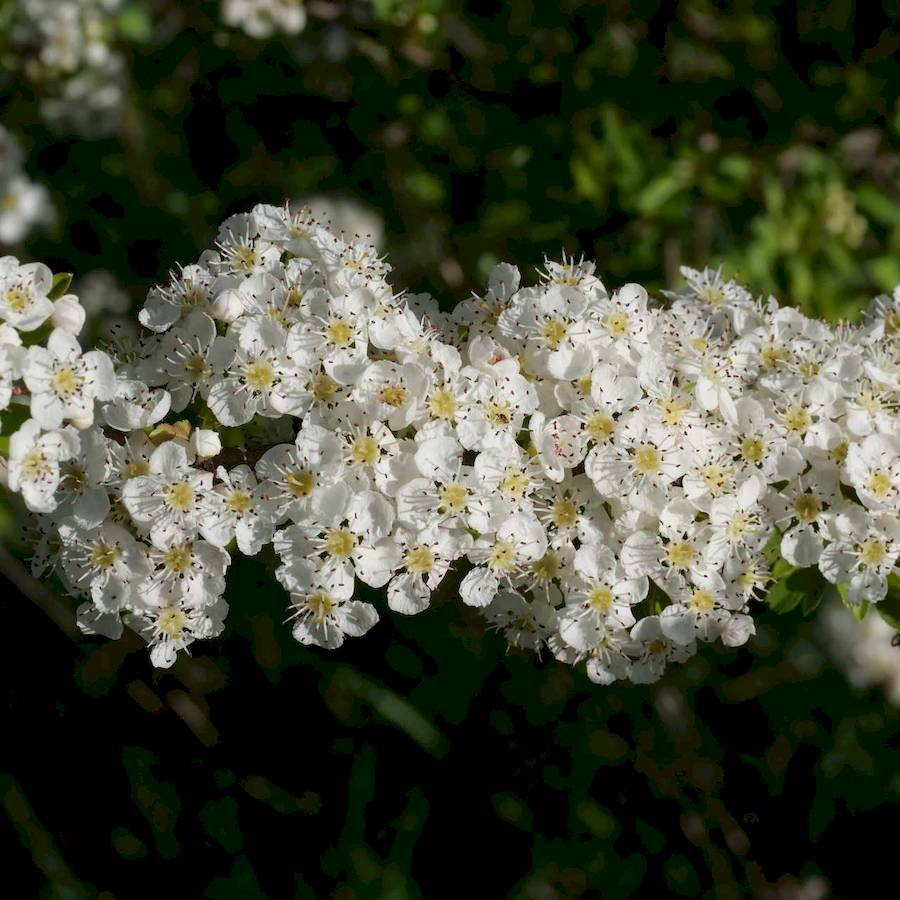

## Rosaceae
# Crataegus monogyna
 **Plant Form** Deciduous tall shrub or small tree. **Size** Up to 10 m tall. **Stem** Woody, with spines 7-20 mm long. **Leaves** Squarish to oval shaped with deep lobes. **Flowers** 5 petal blossoms, white to pink. **Fruit and Seeds** Dark red 8-12 mm diameter, containing one seed each. **Habitat** Forest and riparian areas, roadsides. **Distinguishing Features** Distinguished by leaf shape.

 *Leaves and ripe fruit* 

 *Small tree in flower* 

 *Leafless tree in fruit* 

 *Flowers on a twig* 

