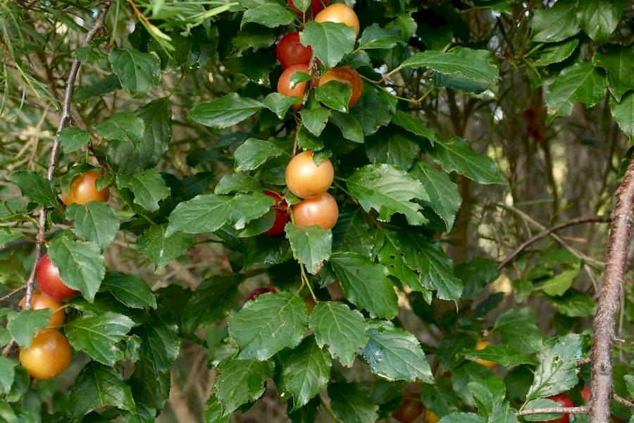
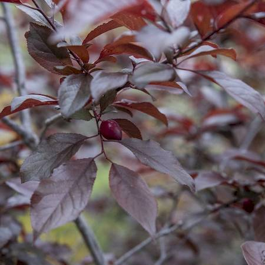
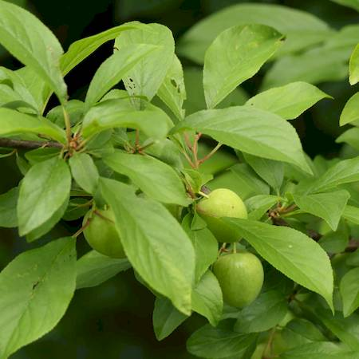
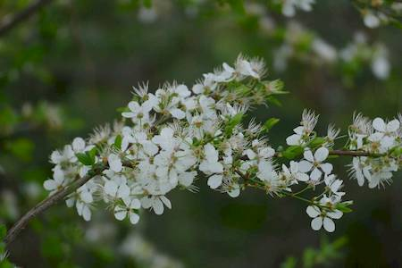

## Rosaceae
# Prunus cerasifera
 **Plant Form** Large deciduous shrub or small tree. **Size** Up to 12 m tall.

 *Fruit in late autumn* 

 *Leaves can be red* 

 *Green leaves* 

 *Leaves and flowers, early Spring* 

