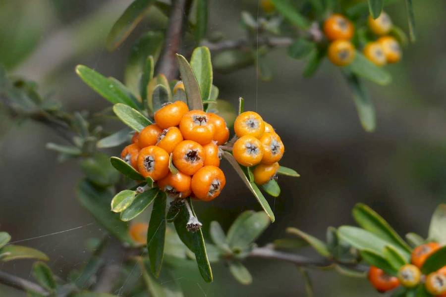
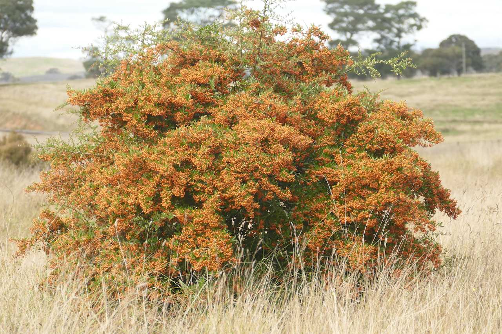

## Rosaceae
# Pyracantha
**common names:** firethorn

**Plant Form** Large spiny evergreen shrubs. **Size** Up to 15 m tall.

   *Fruit in colourful clusters* 

   *Load of berries can be very heavy* 

