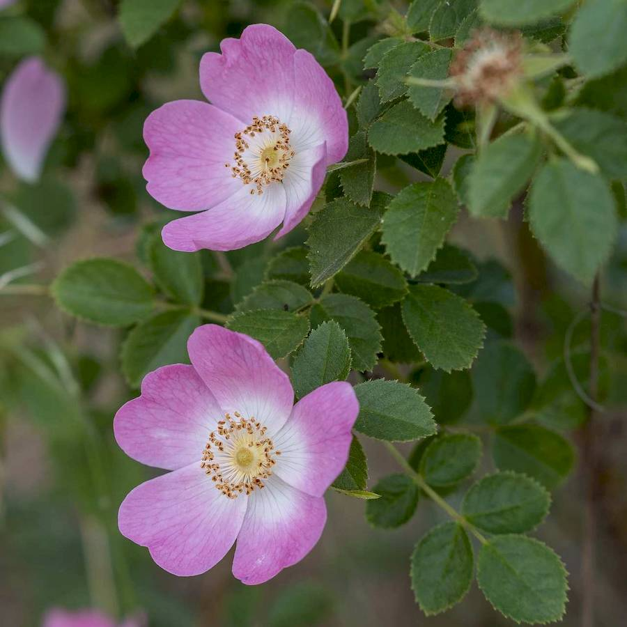
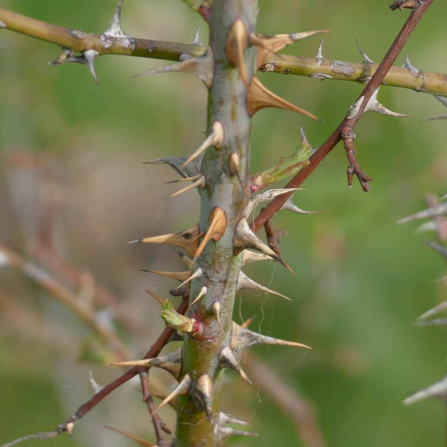
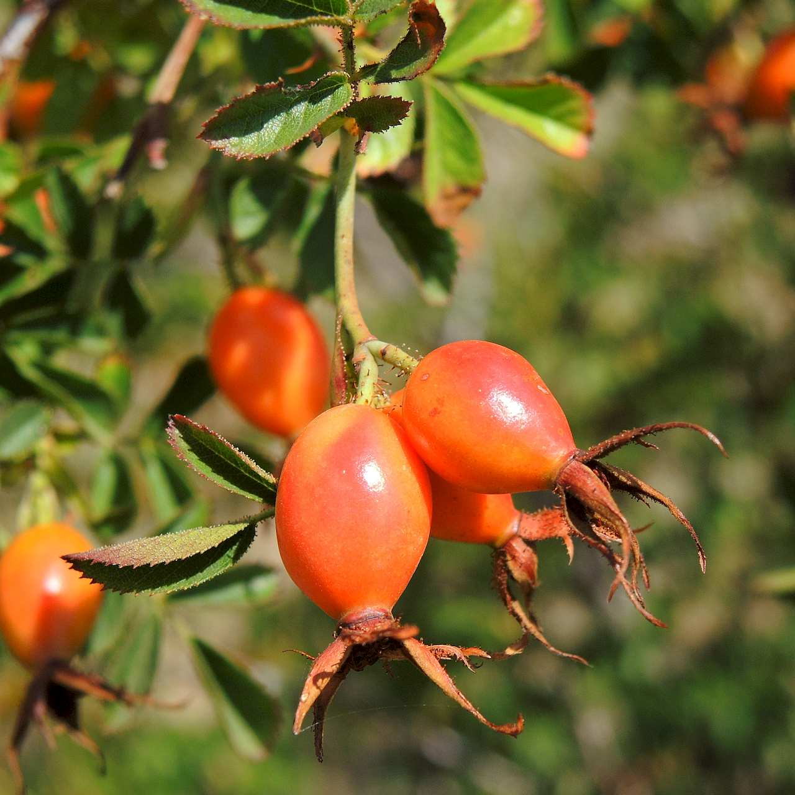
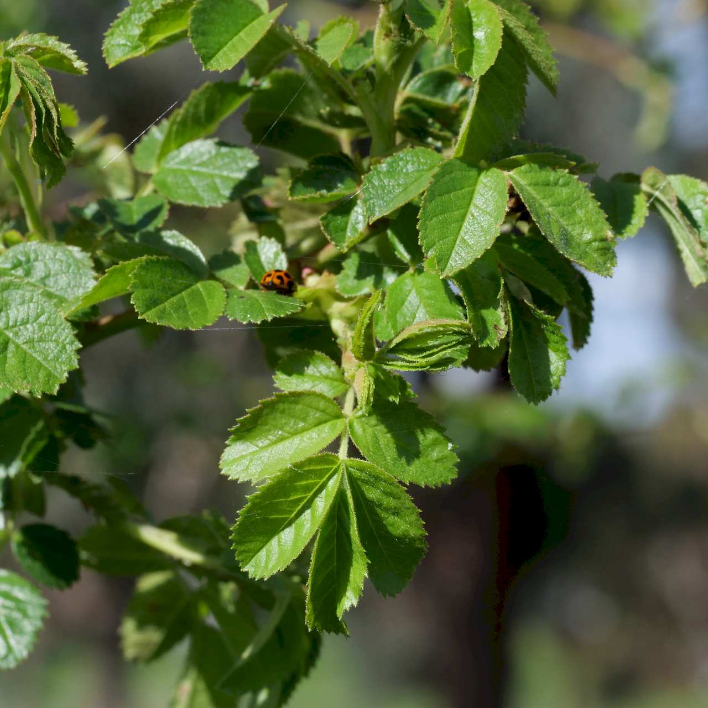
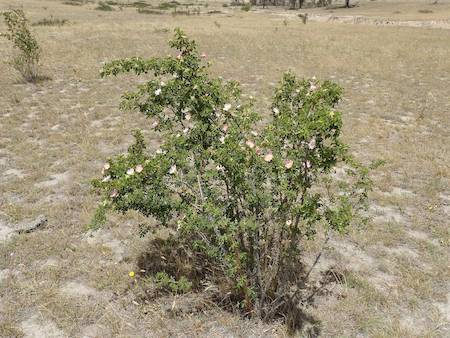

## Rosaceae
# Rosa rubiginosa
**common names:** sweet briar

**Plant Form** Upright or climbing prickly shrub. **Size** 1-3 m tall. **Stem** Upright or arching, smooth and green-reddish brown, to rough and woody with age. With numerous backwards curving prickles just over 1 cm long. **Leaves** Alternately arranged, 5-7 leaflets combined in oval shape with toothed edges. **Flowers** Pink to whitish typical rose flowers, with 5 petals surrounding circular centre. **Fruit and Seeds** Orange-red and smooth to black and shrivelled with age, egg or oval shaped with bristles at base. **Habitat** Grassland, woodland, gullies, alpine areas, riparian areas. **Distinguishing Features** Distinguished from similar Dog rose by hairs or spines on flower stalks and sepals.

   *Flowers* 

   *Spiny stems* 

   *Fruit* 

   *Leaves* 

   *Habit* 

