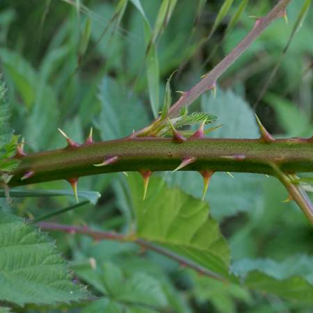

## Rosaceae
# Rubus fruticosus species aggregate
**common names:** blackberry

**Plant Form** Scrambling shrub. **Size** Large dense thickets. **Stem** Up to 7 m long, covered in spines, green to purplish red. **Leaves** Compound with 3-5 leaflets, dark green above and lighter green
below. **Flowers** White or pink with 5 petals, 2-3 cm in diameter. **Fruit and Seeds** Red to black cluster of berries, containing up to 40 seeds each. **Habitat** Gullies, riparian areas, paddocks, forests. **Distinguishing Features** Larger leaves with greener undersides than native raspberry (Rubus
parvifolius).

 *Infested bushland* 

 *Flower close-up* 

 *Thorns* 

 *Leaves affected by a rust fungis* 

 *Leaves and fruit in late summer* 

 *Leaves yellowing before winter* 

 *Leaves* 

 *Cluster of ripe fruit* 

