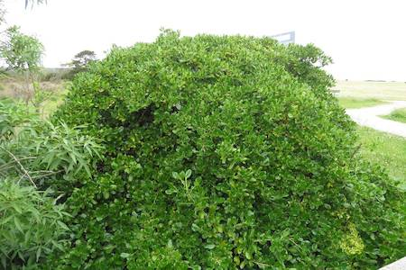

## Rubiaceae
# Coprosma repens
 **Plant Form** Low growing shrub to small tree. **Size** Up to 8m tall. **Stem** Many stiff spreading branches, woody. **Leaves** Oval shaped to almost round, 3-7 cm long, very shiny dark green, paler below. **Flowers** Dense cluster of white funnel like flowers with 5 petals. **Fruit and Seeds** Densely clustered berry like 6-8 mm long green to orange-red, glossy. **Habitat** Coastal dunes and headlands, wetlands. **Distinguishing Features** Very shiny leaves and general shape.

 *Dense bush* 

 *Shiny leaves* 

 *Small berries* 

 *Red when ripe* 

