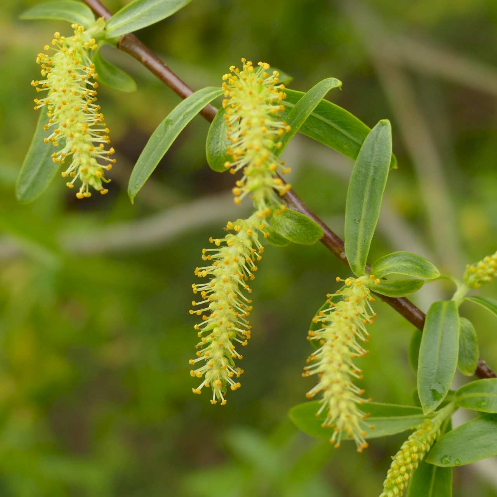
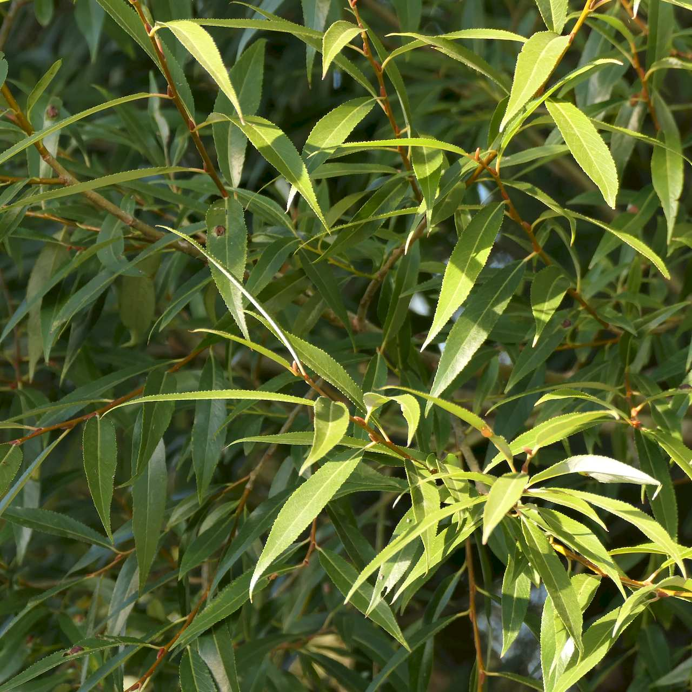
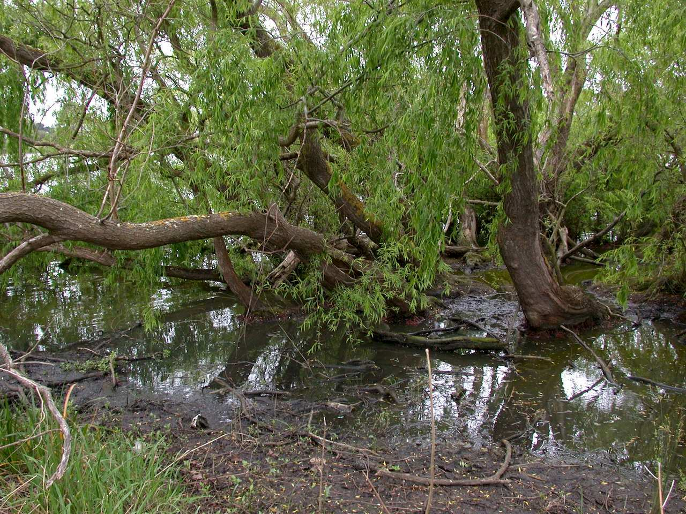
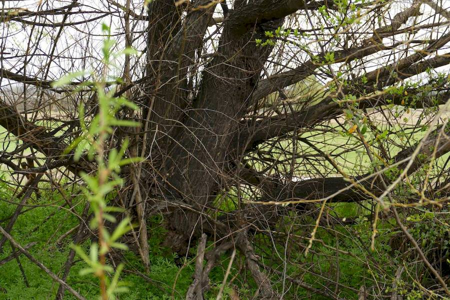
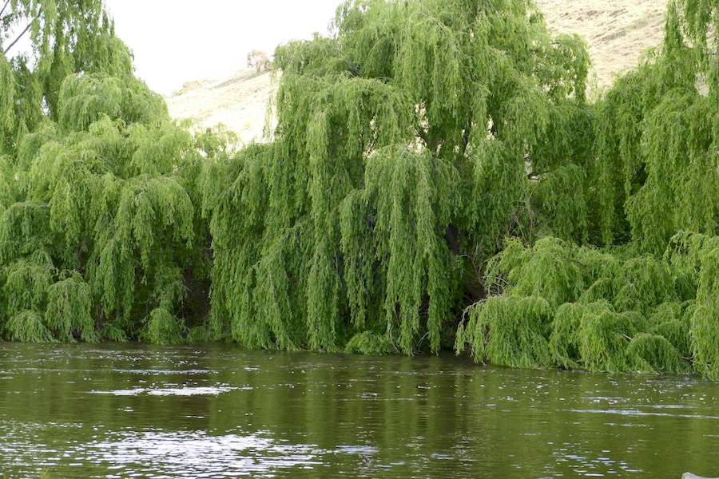

## Salicaceae
# Salix
**common names:** willows

**Plant Form** Deciduous trees or shrubs. **Size** Up to 30m tall.

   *Flowers* 

   *Leaves* 

   *Big trees* 

   *Can have dark trunks* 

   *On river banks* 

