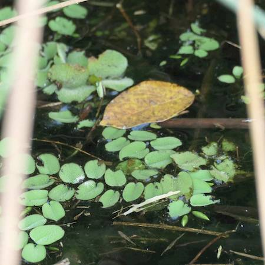

## Salviniaceae
# Salvinia molesta
 **Plant Form** Free-floating mat-forming aquatic fern. **Size** Individual plants 6-25 cm long, but forming large mats. **Stem** Green, covered in fine hairs, slender and submerged. **Leaves** Fronds, light green or yellowish, round to oval, growing in opposite pairs, with many waxy hairs, float on surface in mats. **Flowers** N/A **Fruit and Seeds** N/A **Habitat** Slow moving water bodies like ponds, generally in warmer climates. **Distinguishing Features** Distinctive in later growth phases. Early growth can be distinguished by the opposite frond pairs.

 *Mature plant* 

 *Young plant in reeds* 

 *Habit* 

