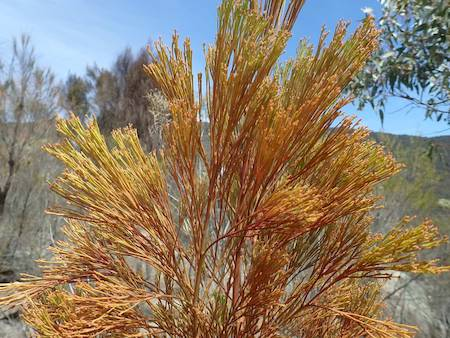
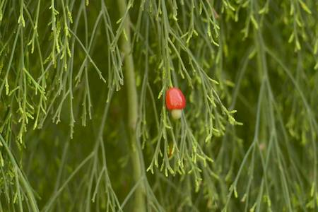

## Santalaceae
# Exocarpos cupressiformis

**Plant Form** Shrub or small tree. **Size** Up to 8m tall.

  
 *Often shaped like a conifer* 

  
 *Foliage often rusty colours* 

  
 *Small red fruit with seed protruding* 

