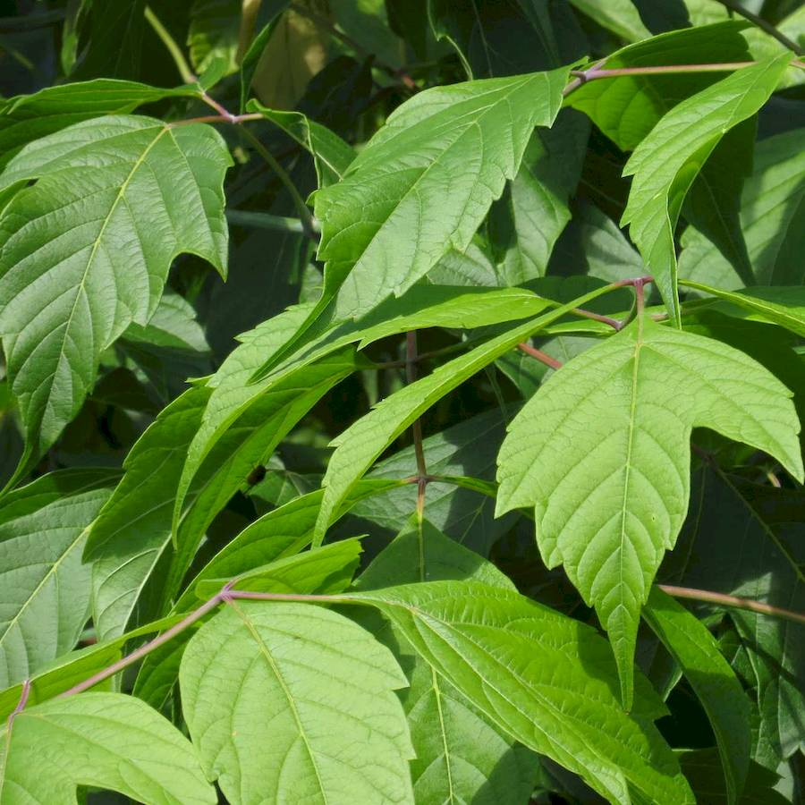
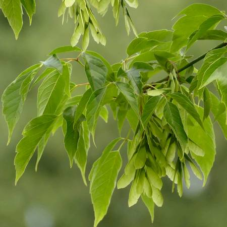
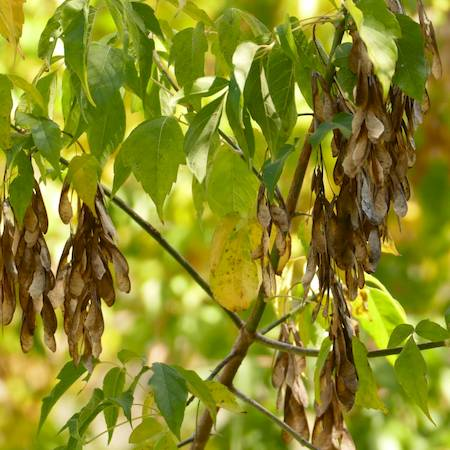
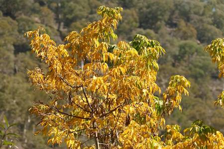
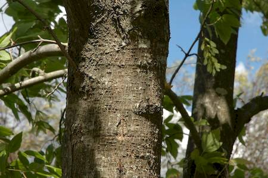

## Sapindaceae
# Acer negundo
**common names:** box elder

**Plant Form** Medium trees. **Size** 6-15 m tall. **Stem** Smooth light grey or brown bark, becoming rougher with age. **Leaves** Large leaves 20-30 cm long, divided into 3-9 oval or egg-shaped leaflets. **Flowers** Greenish to pinkish, wihtout petals, in clusters (male) or drooping on stalk (female). **Fruit and Seeds** Dry, winged green to brown as mature. V-shaped and fly like propellors. **Habitat** Along watercourses, wet forests, woodlands, roadsides and other disturbed areas. **Distinguishing Features** Smaller and more complex leaves than similar Sycamore maple. Propellor like fruits differ from ashes.

 *compound leaves* 

 *green seed* 

 *mature seed* 

 *Foliage yellowing before falling* 

 *trunk* 

