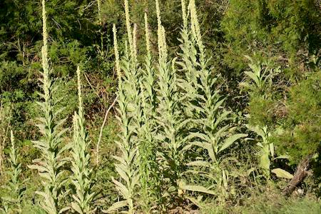
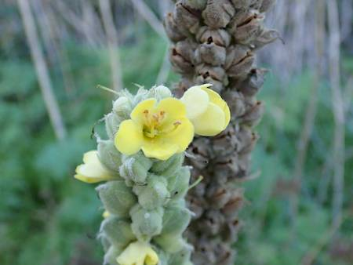

## Scrophulariaceae
# Verbascum thapsus
 **Plant Form** Large annual or biennial rosette herb. **Size** Up to 3 m tall.

 *Young plants* 

 *Flowering plants* 

 *Dead flowers - winter* 

 *Flowers* 

