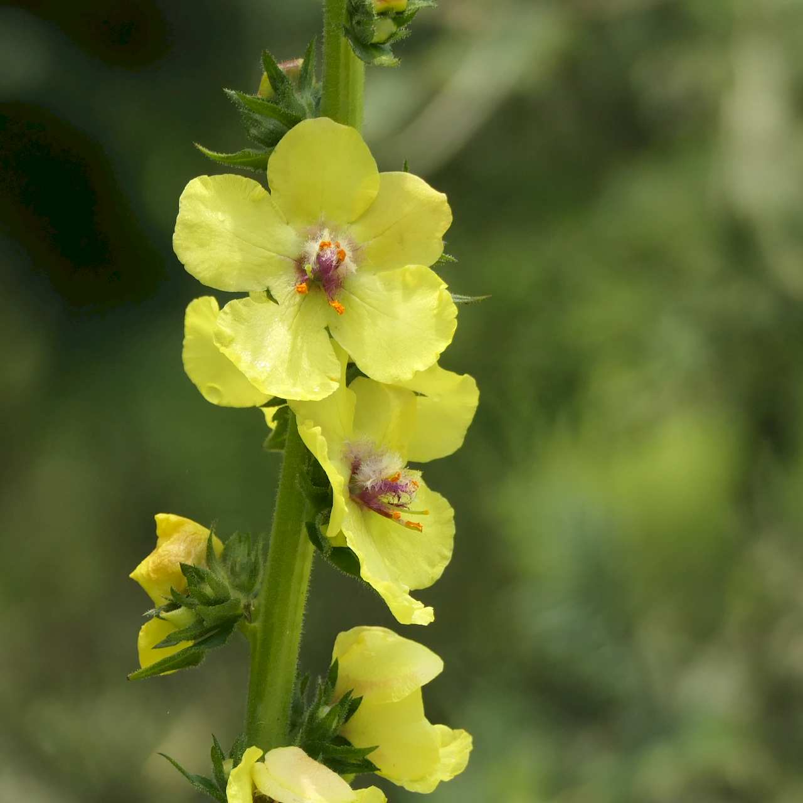
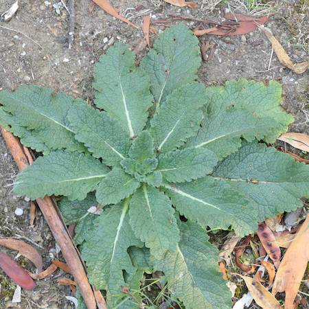
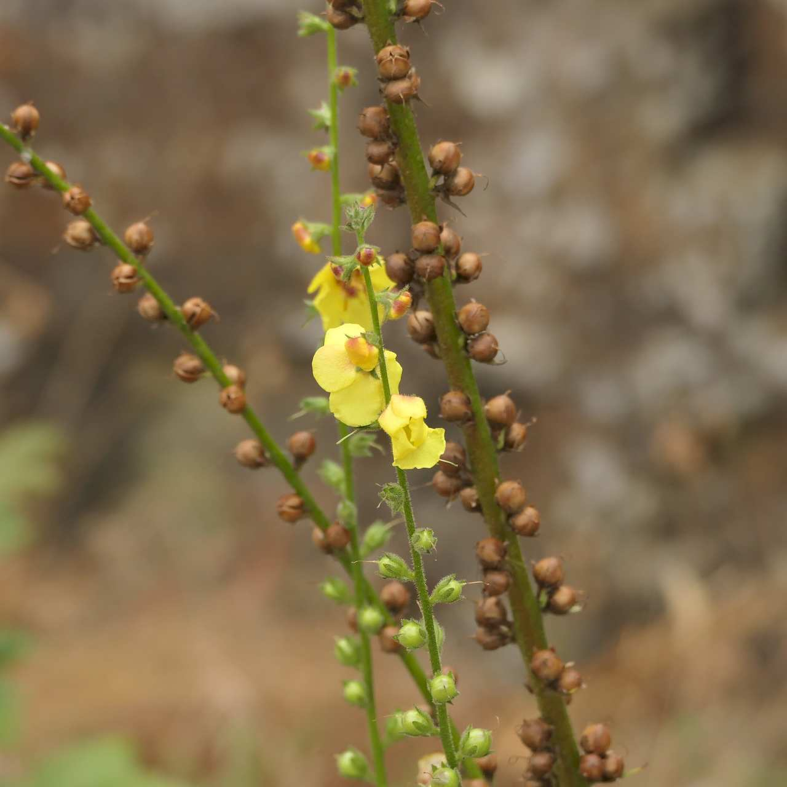

## Scrophulariaceae
# Verbascum virgatum

**Plant Form** Upright biennial herb. **Size** Up to 2 m tall.

   *Flowers* 

   *Young plant* 

   *Seed capsules* 

   *Flower stalk leaves* 

   *Habit* 

