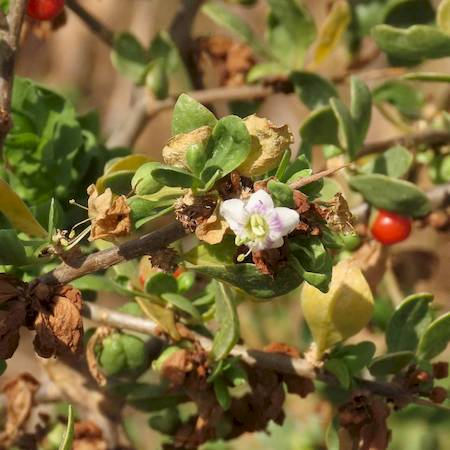
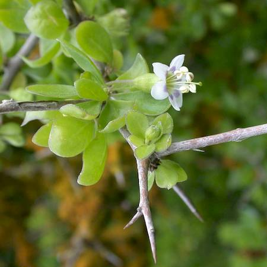
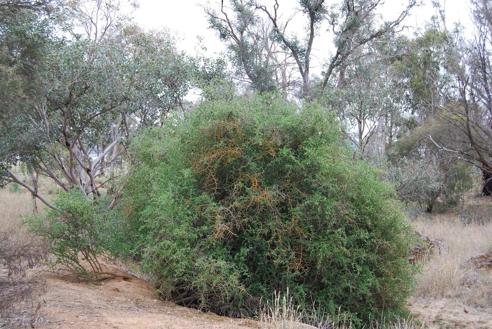
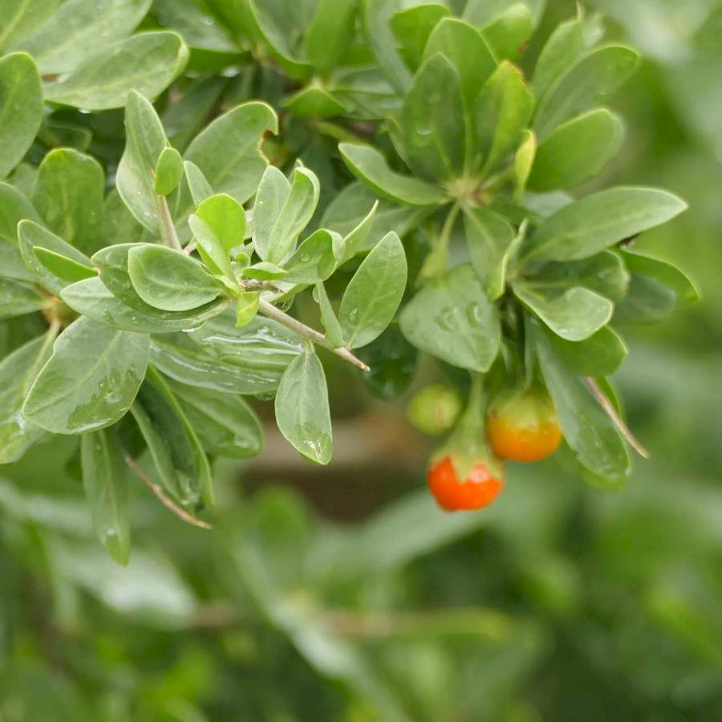

## Solanaceae
# Lycium ferocissimum
**common names:** African boxthorn

**Plant Form** Upright spiny shrub. **Size** Up to 6 m tall. **Stem** Woody, rigid, branched, with thorns up to 15 cm long. **Leaves** Oval with rounded tip, fleshy, bright green, 10-40 mm long. **Flowers** White to purple with 5 petals, 1 cm diameter. **Fruit and Seeds** Round berries, green when unripe and red when ripe, 5-10 mm diameter, 20-70 seeds per fruit. **Habitat** Dry, sandy woodlands, rangelands, roadsides and waterways. **Distinguishing Features** Larger berries and stamens extending outside of the flower compared to native Lycium australe.

 *Small flowers and fruit* 

 *Twigs end in spines* 

 *Big, dense bushes* 

 *Leaves* 

