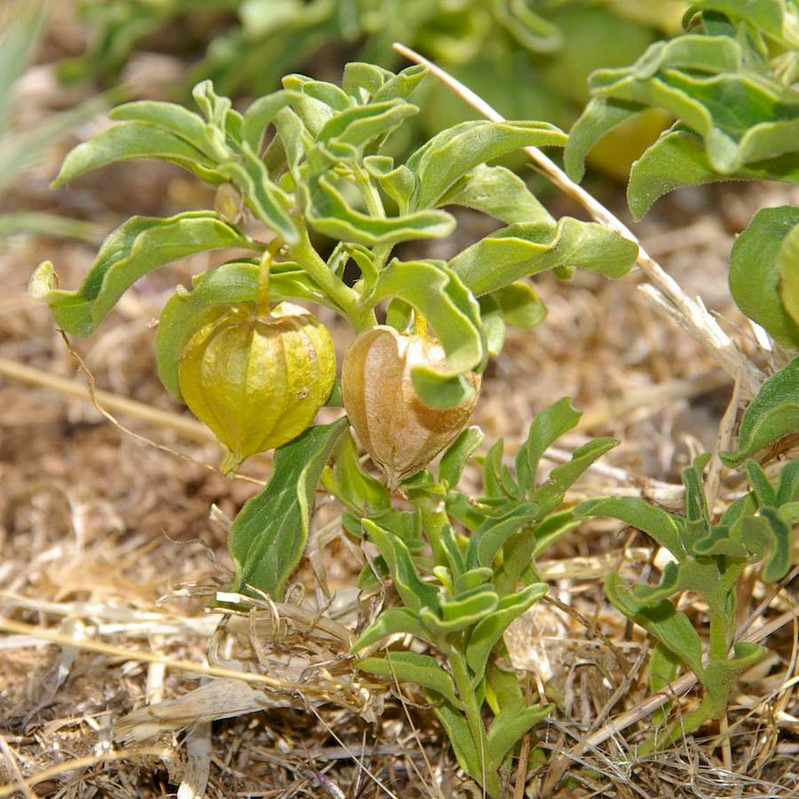
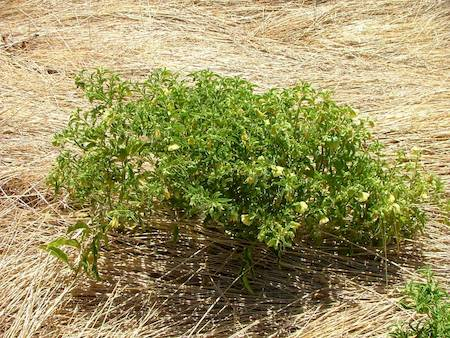
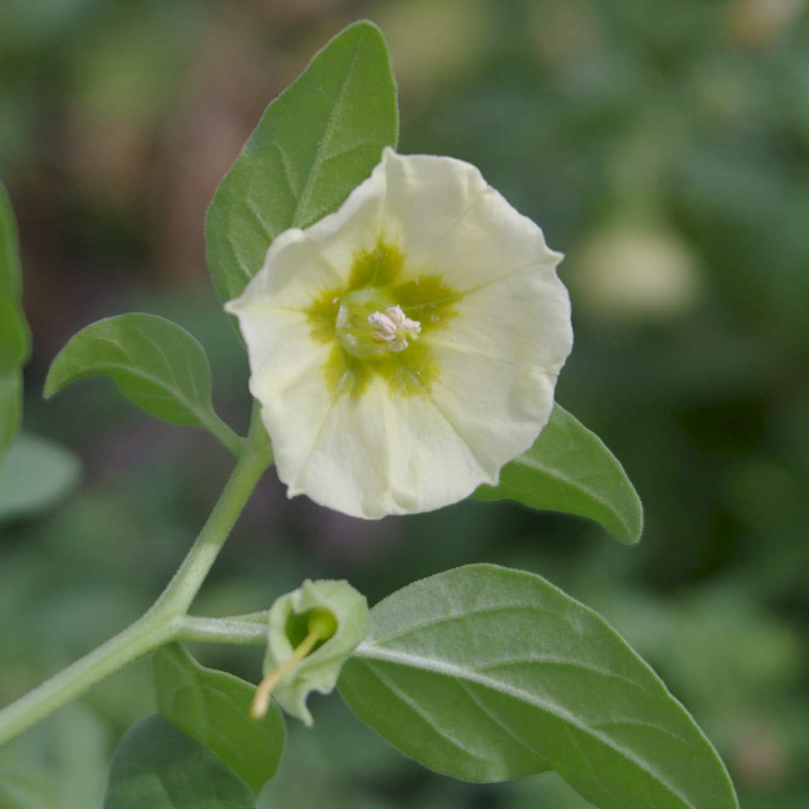
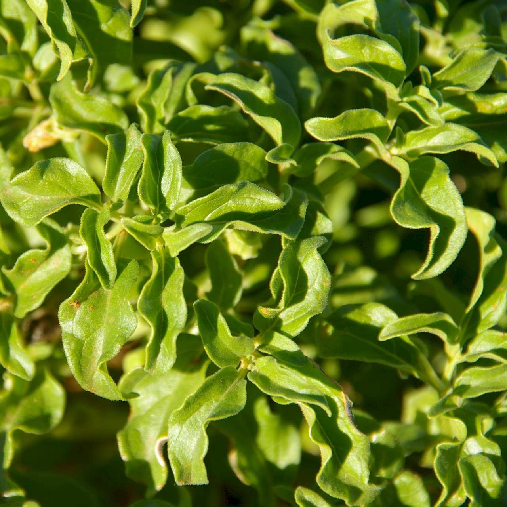
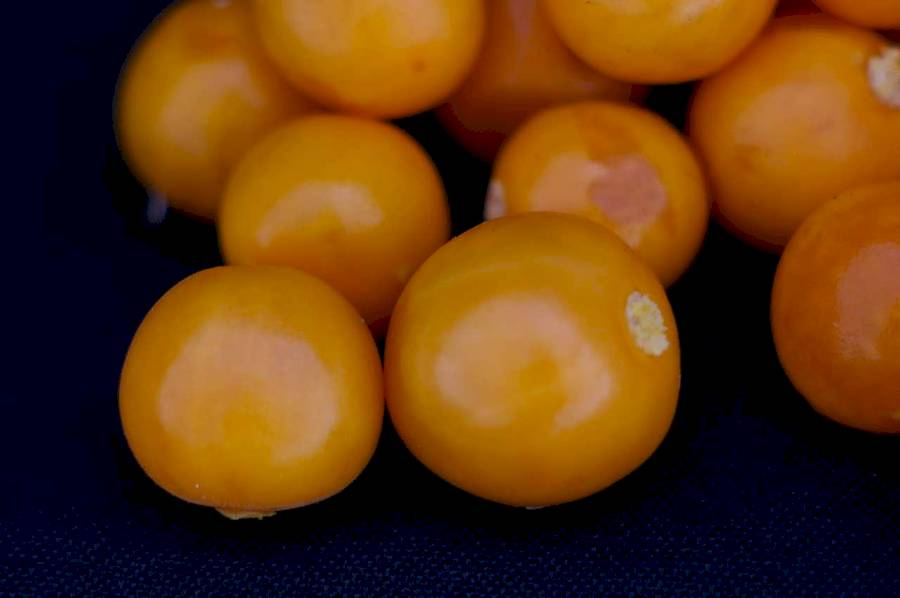

## Solanaceae
# Physalis hederifolia
**common names:** prarie ground cherry

**Plant Form** Perennial herb. **Size** Up to 60 cm tall. **Stem** Branched, spreading, ribbed, and with very short hairs. **Leaves** Light green, mostly alternate along stem, but upper leaves can be opposite. Some hairs on edges and veins. Egg shaped with wavy edges. Often curled inwards. **Flowers** Pale yellow, bell-shaped 3 cm diameter, with 5 fused petals. **Fruit and Seeds** Orange coloured globular berry up to 1.5 cm diameter in bladder like case. 20 seeds per berry. **Habitat** Pastures, crops, roadsides. **Distinguishing Features** Combination of features.

  
 *Fruit and leaves* 

  
 *Larger plant (H Wu)* 

  
 *Flower* 

  
 *Leaves* 

  
 *Orange fruit inside papery cover* 

