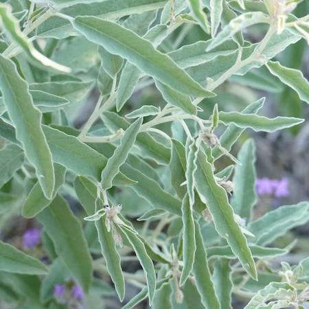

## Solanaceae
# Solanum elaeagnifolium
 **Plant Form** Erect perennial herb. **Size** Up to 1 m tall. **Stem** Slender with reddish or yellow spines. **Leaves** Oblong to lance shaped 2-10 cm long, with white hairs covering surfaces, giving them silvery appearance. **Flowers** Typical nightshade blueish purple to occasionally pink or white 2-4 cm diameter, 5 fused petals with yellow stamens. **Fruit and Seeds** Berries, green to yellow or brownish when ripe, with 50-odd tomato-like seeds. **Habitat** Cultivated areas, waste areas. **Distinguishing Features** Leaves with silver appearance due to whitish hairs, but otherwise can closely resemble other Solanums.

 *Flower* 

 *Habit* 

 *Fruit* 

 *Leaves* 

