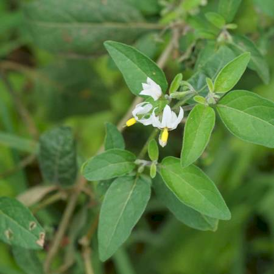

## Solanaceae
# Solanum nigrum

**Plant Form** Erect or speading annual herb or shrub. **Size** Up to 1.3 m tall. **Stem** Rough green or purplish green, occasionally hairy. **Leaves** Alternately arranged 2-13 cm long on stalks, oval or lance shaped tapering to a pointed tip, with variable edges which are whole, toothed or lobed. Sparsely hairy on both sides. **Flowers** Small star shaped white or purplish tinted with yellow cylindrical centre, typical solanum flowers. **Fruit and Seeds** Clusters of globular berries, turning from green to black with maturity. Containing numerous small seeds. On short stalks pointing downwards. **Habitat** Pastures, cropping areas, gardens, roadsides, waste areas. **Distinguishing Features** Very similar to American Nightshade, and can hybridise with it, but generally duller berries which are on downward stalks.

  
 *Fruit* 

  
 *Leaves* 

  
 *Flowers* 

