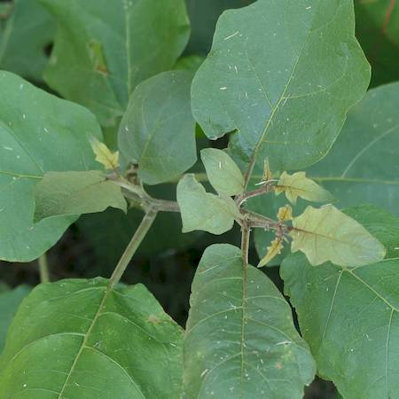

## Solanaceae
# Solanum torvum
**common names:** devil's fig

**Plant Form** Erect shrub or small tree. **Size** 80 cm to 5 m tall. **Stem** Green or purplish and hairy turning to brown and less hairy with age. Sometimes sparsely covered with 3-7 mm long prickles. **Leaves** Alternate along stem, green on top with paler green underneath, oval shaped and often with lobes, cream coloured vein running down middle which is sometimes prickly. **Flowers** White, star shaped with yellow central column. Up to 2.5 cm wide. In large clusters of 15-100. **Fruit and Seeds** A round berry, initially green ripening to yellow, and black when dried out. Contains white, pale yellow or dull brown seeds. **Habitat** Gardens, woodlands, waterways, pastures, roadsides. **Distinguishing Features** Smaller than Giant devil's fig, and larger but with smaller fruit than Tropical soda apple.

  
 *Fruit* 

  
 *Flowers* 

  
 *Leaves slightly lobed* 

  
 *Few spines, soft brown hairs on new leaves* 

