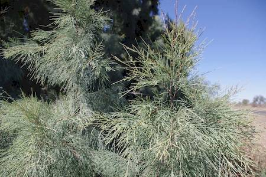

## Tamaricaceae
# Tamarix aphylla
**common names:** athel pine

**Plant Form** Small spreading tree. **Size** Up to 12 m tall. **Stem** Reddish-brown to grey-green and smooth when young, turning darker and rough with age. **Leaves** Tiny scales 1-2 mm long arranged along cylindrical branchlets. **Flowers** Pale pink to white, small in long clusters with 5 small petals. **Fruit and Seeds** Bell shaped capsules 2-3 mm long, with numerous hairy seeds within. **Habitat** Along waterways, woodlands, grasslands, pastures, roadsides. **Distinguishing Features** Combination of characteristics. Flowers are distinctive from pines and casuarinas but hard to distinguish from other tamarisks.

   *Leaves often grey* 

   *Spreys of small pink flowers* 

   *Medium tree* 

   *Trunk* 

   *Leaves are segmented* 

