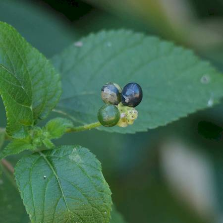
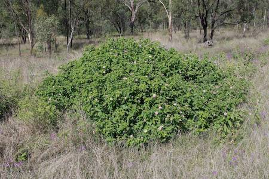

## Verbenaceae

# Lantana camara

 **Plant Form** Branching scrambling shrub forming thickets. **Size** Up to 15 m tall. **Stem** Quadrangle shaped turning cylindrical and thick with age. With many curved spikes. **Leaves** Egg shaped in opposite pairs 4-10 cm long with toothed edges. **Flowers** Dense circular clusters of 20-40, brightly coloured pink, red, orange or white. **Fruit and Seeds** Berries, green then purple or black when ripe, with 1-2 seeds. **Habitat** Gullies, riparian areas, disturbed areas, fencelines. **Distinguishing Features** Flowers and leaves.

 *Flowers in heads* 

 *Small black berries* 

 *Flowers mostly pink or red* 

 *Clumps in open country* 

 *Scrambling thickes in forests* 

 *Leaves have short, stiff hairs* 
